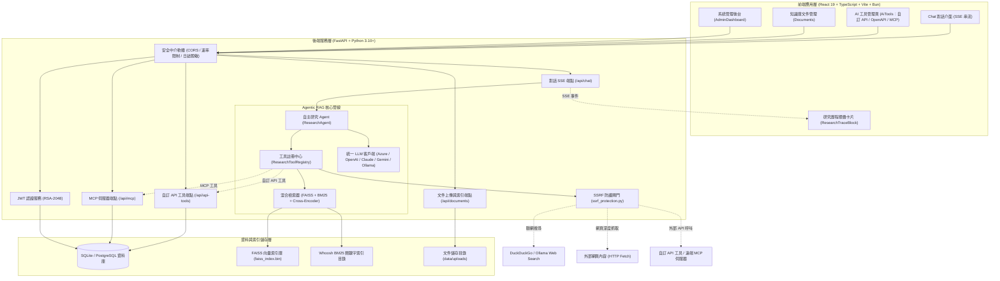

# AskMiao (AI ChatBot)

基於增強型混合 RAG（檢索增強生成）與 Agentic 自主研究架構的企業級智慧知識庫對話系統。

[繁體中文](README.md) | [English](README_en.md)

[](https://fastapi.tiangolo.com/)
[](https://react.dev/)
[](https://www.python.org/)
[](https://vitejs.dev/)
[](https://bun.sh/)
[](https://www.sqlite.org/)
[](LICENSE)

[快速開始](#快速開始) | [核心功能特色](#核心功能特色) | [系統架構與設計](#系統架構與設計) | [專案目錄結構](#專案目錄結構) | [環境配置矩陣](#環境配置矩陣) | [文件導覽](#文件導覽) | [貢獻指南](#貢獻指南) | [授權條款](#授權條款)

---

## 快速開始

### 環境要求

| 組件名稱 | 最低版本要求　　　 | 建議工具與用途說明　　　　　　　　　　　　　　　　　　　 |
| ----------| --------------------| ----------------------------------------------------------|
| Python　 | 3.10 或更高版本　　| 後端 FastAPI 伺服器、RAG 向量索引與 Agentic 自主研究引擎 |
| Bun　　　| 1.0 或更高版本　　 | 前端優先使用之套件管理與建構打包工具　　　　　　　　　　 |
| SQLite　 | 3.x（Python 內建） | 零依賴本機啟動之關聯式資料庫（亦支援 PostgreSQL）　　　 |

### 1. 複製專案倉庫

```bash
git clone https://github.com/Scorpio-meow/AskMiao.git
cd AskMiao
```

### 2. 後端服務設定與啟動

```bash
cd backend

# 建立並啟用 Python 虛擬環境
py -m venv .venv

# Windows PowerShell 啟用：
.\.venv\Scripts\Activate.ps1
# Linux/macOS 啟用：
source .venv/bin/activate

# 安裝後端依賴套件
pip install -r requirements.txt

# 複製環境變數範本後依實際環境調整
# 注意：.env.example 之 DATABASE_URL 預設指向 PostgreSQL，
#      若要零依賴啟動請改為 DATABASE_URL=sqlite:///./chatbot.db
cp .env.example .env

# 初始化資料庫表格與管理員帳號
py init_db.py

# 啟動 FastAPI 開發伺服器 (Port 8001)
py main.py
```

### 3. 前端服務設定與啟動 (使用 Bun)

```bash
cd ../frontend

# 使用 Bun 安裝前端依賴項目
bun install

# 啟動 Vite 前端開發伺服器 (未設定 PORT 時為 3000)
bun run dev
```

伺服器啟動後，開啟瀏覽器造訪 `http://localhost:3000` 即可進入 AskMiao 知識庫對話系統。
若沿用 `frontend/.env.example` 的 `PORT=3001`（亦為後端 `ALLOWED_ORIGINS` 預設允許之來源），則改為 `http://localhost:3001`。

---

## 核心功能特色

1. **Agentic RAG 多輪自主研究**：
   - 內建 ReAct 自主研究 Agent（`ResearchAgent`），支援原生工具調用（Native Tool Calling）。
   - 提供內部知識庫搜尋（`search_knowledge_base`）、外部即時聯網搜尋（`web_search`，支援 Ollama 與 DuckDuckGo 雙引擎備援）與深度網頁抓取（`web_fetch`）。
   - 前端即時呈現可折疊之結構化研究歷程（Research Trace Timeline）與可點擊跳轉之來源標籤（Source Badges）。

2. **多檔位模型推理程度（Reasoning Effort）選擇**：
   - 頂部導覽列支援切換五種推理深度檔位：`無 (None)`、`輕度 (Low)`、`標準 (Medium)`、`深度 (High)`、`極致 (X-High)`。
   - 完整支援 Azure OpenAI v1 與 OpenAI 推理模型（如 GPT-5 系列、o-series）。
   - 依微軟 Foundry 規範自動處理工具調用與推理相容性限制。

3. **模組化增強型混合 RAG 檢索引擎**：
   - 結合 FAISS 稠密向量搜尋（Dense Retrieval）與 Whoosh BM25 中文稀疏文字檢索（Sparse Retrieval）。
   - 搭配 Cross-Encoder (`ms-marco-MiniLM-L-6-v2` / `bge-reranker-base`) 進行加權重排序，確保知識檢索精準度。
   - 支援自動動態調整 Alpha 權重與 RAG 檢索評估指標（Hit Rate, MRR）。

4. **多模型提供商彈性整合**：
   - 提供統一的 LLM 調用抽象層，支援 Azure OpenAI v1、OpenAI 官方 API、Anthropic Claude、Google Gemini 與本地 Ollama 模型動態切換與自動多模型清單拆分。

5. **企業級安全與雙層日誌脫敏**：
   - 採用 RSA-2048 非對稱密鑰簽署之 JWT Access Token 與 HttpOnly 安全 Cookie。
   - 內建物件層級遞迴脫敏與字串正則遮罩防護（`security_logging.py`），嚴格防範密碼、Token 與機敏資料洩漏至系統日誌。
   - 對外錯誤回應僅揭露隨機錯誤代碼（`error_response.py`），完整例外與堆疊只寫入伺服器日誌（CWE-209 / CWE-497）。
   - 所有外部網址請求（OpenAPI 規格匯入、`web_fetch`、MCP HTTP 傳輸）皆經 `ssrf_protection.py` 解析後驗證，阻擋內網位址、雲端中繼資料端點與危險連接埠。

6. **外部工具擴充與 MCP 生態整合**：
   - 支援以表單自訂 HTTP API 工具，或直接貼上 OpenAPI / Swagger 規格（OAS 2.0 / 3.0 / 3.1）批次匯入端點為 AI 可調用工具。
   - 支援 Bearer、API Key（Header / Query）與 Basic 三種認證方式，並可於管理頁面即時測試工具連通性。
   - 內建 MCP（Model Context Protocol）用戶端，支援 `stdio` 與 HTTP 兩種傳輸，可探索伺服器工具清單並自動注入 Agent 工具集。
   - 啟用中的自訂 API 工具與 MCP 工具會於每次組裝工具定義時動態載入，無需重啟後端。

7. **多模態對話與知識庫智能摘要**：
   - 對話支援附加圖片與文件，圖片以 `image_url` 形式傳入視覺模型，文字檔則自動抽取內容併入提問上下文。
   - 文件上傳時自動生成 AI 文件大綱與摘要，並可於文件管理頁面重新生成或手動修訂。

---

## 系統架構與設計



---

## 專案目錄結構

```text
AskMiao/
├── backend/                        # 後端 FastAPI 專案
│   ├── app/
│   │   ├── api/                    # RESTful API 路由端點
│   │   │   ├── auth.py             # 註冊、登入、刷新與登出
│   │   │   ├── chat.py             # 對話 SSE 串流、模型與工具清單
│   │   │   ├── documents.py        # 文件上傳、摘要與索引重建
│   │   │   ├── api_tools.py        # 自訂 API 工具 CRUD、OpenAPI 解析與匯入
│   │   │   ├── mcp.py              # MCP 伺服器管理、工具探索與測試
│   │   │   ├── admin.py            # 管理後台統計與向量庫維運
│   │   │   └── tags.py             # 相容 Ollama 之模型清單端點
│   │   ├── core/                   # 核心設定、安全認證、日誌脫敏與 LLM 客戶端
│   │   │   ├── config.py           # 系統全域環境變數配置
│   │   │   ├── jwt_auth.py         # RSA-2048 JWT 簽章與驗證
│   │   │   ├── llm_client.py       # 多提供商 LLM 統一調用層
│   │   │   ├── security_logging.py # 敏感資料雙層遮罩日誌系統
│   │   │   ├── error_response.py   # 對外錯誤代碼與例外日誌對應機制
│   │   │   └── ssrf_protection.py  # 外部網址解析驗證與 SSRF 阻擋
│   │   ├── models/                 # SQLAlchemy ORM 與 Pydantic 驗證模型
│   │   ├── rag/                    # 模組化 RAG 與 Agentic 研究核心
│   │   │   ├── agent.py            # ReAct 自主研究 Agent（含多模態輸入組裝）
│   │   │   ├── tools.py            # 內建工具集與自訂 / MCP 工具動態註冊
│   │   │   ├── pipeline.py         # RAG 執行管線與上下文組裝
│   │   │   ├── contextual_rag.py   # HybridContextualRAG 門面模組
│   │   │   ├── evaluator.py        # 檢索評估與自動 Alpha 調優
│   │   │   ├── indices/            # FAISS 與 BM25 索引管理模組
│   │   │   └── retrievers/         # 混合檢索與 Cross-Encoder 重排序器
│   │   ├── services/               # 業務邏輯服務層
│   │   │   ├── chat_service.py     # 對話與訊息持久化
│   │   │   ├── document_processor.py # 文件解析與 AI 摘要生成
│   │   │   ├── openapi_parser.py   # OpenAPI / Swagger 規格解析器
│   │   │   └── mcp_service.py      # MCP stdio / HTTP 用戶端與工具轉換
│   │   └── tasks/                  # 背景排程任務 (定時索引重建、上傳監控)
│   ├── tests/                      # 後端測試（自主研究、工具、MCP、SSRF）
│   ├── main.py                     # FastAPI 應用程式主進入點
│   ├── init_db.py                  # 資料庫初始化與預設管理員建立腳本
│   └── requirements.txt            # Python 依賴清單
├── frontend/                       # 前端 React 19 + Vite 專案
│   ├── src/
│   │   ├── pages/                  # 前端頁面元件
│   │   │   ├── Chat/               # Chat 模組 (MessageItem, TraceBlock, SourceBadges, Header)
│   │   │   ├── AiTools.jsx         # AI 工具管理（自訂 API、OpenAPI 匯入、MCP 伺服器）
│   │   │   ├── Documents.jsx       # 知識庫文件上傳與管理頁面
│   │   │   ├── AdminDashboard.jsx  # 系統管理後台
│   │   │   ├── LoginPage.jsx / RegisterPage.jsx # 登入與註冊頁面
│   │   │   └── ProfilePage.jsx     # 個人資料頁面
│   │   ├── hooks/                  # React 自訂 Hooks (useChat, useAuth, useDocuments)
│   │   ├── services/               # Axios API 請求封裝與 Token 攔截器
│   │   └── components/             # 通用 UI 元件與 Layout
│   ├── package.json                # 前端專案設定 (使用 Bun 管理)
│   └── vite.config.js              # Vite 建構配置
├── docs/                           # 詳細系統規格與架構文件
│   ├── api.md                      # API 參考文件 (繁體中文)
│   ├── api_en.md                   # API 參考文件 (英文)
│   ├── architecture.md             # 系統架構與設計 (繁體中文)
│   ├── architecture_en.md          # 系統架構與設計 (英文)
│   └── adr/                        # 架構決策紀錄 (ADR)
├── llms.txt                        # AI 友善結構索引 (繁體中文)
├── llms_en.txt                     # AI 友善結構索引 (英文)
├── CHANGELOG.md                    # 版本變更紀錄 (繁體中文)
├── CHANGELOG_en.md                 # 版本變更紀錄 (英文)
└── LICENSE                         # MIT 授權條款
```

---

## 環境配置矩陣

### 後端環境變數 (`backend/.env`)

| 變數名稱 | 描述 | 範例 / 預設值 | 必填 |
|---|---|---|---|
| `DATABASE_URL` | 資料庫連線字串（無預設值，必須提供） | `sqlite:///./chatbot.db`、`postgresql+psycopg2://...` | 是 |
| `JWT_SECRET_KEY` | JWT 簽署金鑰 | `cb_jwt_sec_...` | 是 |
| `ADMIN_API_KEY` | 系統管理員 API 金鑰 | `cb_admin_key_...` | 是 |
| `LLM_API_BASE` | 本地 Ollama 服務端點 URL | `http://localhost:11434` | 否 |
| `MODEL_NAME` | 預設模型名稱（未設定時取第一個可用模型） | 空值 | 否 |
| `ENABLE_WEB_SEARCH` | 是否啟用 Agent 聯網搜尋工具 | `true` | 否 |
| `AGENT_MAX_TURNS` | Agent 自主研究最大工具調用輪數 | `5` | 否 |
| `AZURE_OPENAI_API_KEY` | Azure OpenAI API 金鑰 | `your_azure_api_key` | 否 |
| `AZURE_OPENAI_ENDPOINT` | Azure OpenAI v1 服務端點 URL | `https://your-resource.openai.azure.com` | 否 |
| `AZURE_OPENAI_DEPLOYMENT` | Azure OpenAI 部署名稱（支援逗號分隔多模型） | `gpt-4o,gpt-4o-mini` | 否 |
| `OPENAI_API_KEY` | OpenAI 官方 API 金鑰 | `sk-...` | 否 |
| `OPENAI_VISION_MODEL` | 多模態圖片理解所用之 OpenAI 模型 | `gpt-4o` | 否 |
| `ANTHROPIC_API_KEY` | Anthropic Claude API 金鑰 | `sk-ant-...` | 否 |
| `GEMINI_API_KEY` | Google Gemini API 金鑰 | `AIza...` | 否 |
| `GEMINI_VISION_MODEL` | 多模態圖片理解所用之 Gemini 模型 | `gemini-2.5-flash` | 否 |
| `AVAILABLE_MODELS` | 手動指定前端可選模型清單（逗號分隔） | 空值 | 否 |
| `EMBEDDING_MODEL` | 向量嵌入模型名稱 | `BAAI/bge-small-zh-v1.5` | 否 |
| `RERANKER_MODEL` | Cross-Encoder 重排序模型名稱 | `BAAI/bge-reranker-base` | 否 |
| `CHUNK_SIZE` / `CHUNK_OVERLAP` | 文件切塊大小與重疊字元數 | `300` / `100` | 否 |
| `HYBRID_ALPHA` | 向量與 BM25 分數融合權重 | `0.75` | 否 |
| `FINAL_K` | 最終送入 LLM 之片段數量 | `8` | 否 |
| `MAX_FILE_SIZE_MB` | 單一上傳檔案大小上限 | `10` | 否 |
| `ACCESS_TOKEN_EXPIRE_MINUTES` | Access Token 有效分鐘數 | `30` | 否 |
| `REFRESH_TOKEN_EXPIRE_DAYS` | Refresh Token 有效天數 | `7` | 否 |
| `ALLOWED_ORIGINS` | CORS 允許來源（逗號分隔） | `http://localhost:3001` | 否 |
| `RATE_LIMIT_ENABLED` / `RATE_LIMIT_PER_MINUTE` | 速率限制開關與每分鐘上限 | `true` / `60` | 否 |

> 完整變數清單請參閱 [`backend/.env.example`](./backend/.env.example) 與 [`backend/app/core/config.py`](./backend/app/core/config.py)。

### 前端環境變數 (`frontend/.env`)

| 變數名稱 | 描述 | 預設值 | 必填 |
|---|---|---|---|
| `VITE_API_BASE` | 後端 API 基礎路徑（未設定時回退至 `/api`） | `http://localhost:8001` | 否 |
| `VITE_API_URL` | 後端伺服器絕對端點（`VITE_API_BASE` 未設定時採用） | `http://localhost:8001` | 否 |
| `VITE_TAGS_URL` | 外部模型清單來源 URL | 空值 | 否 |
| `VITE_MODEL_POLL_INTERVAL_MS` | 前端模型清單輪詢間隔（毫秒） | `300000` | 否 |
| `PORT` | Vite 開發伺服器埠號 | `3001` | 否 |

---

## 文件導覽

- [API 參考文件](./docs/api.md) — 完整 RESTful 端點、請求回應 JSON 規格與參數說明
- [系統架構與設計文件](./docs/architecture.md) — 模組關係圖、Agentic RAG 管線與安全架構
- [架構決策紀錄 (ADR)](./docs/adr/README.md) — 專案架構演進與技術選型紀錄
- [AI 友善結構導覽](./llms.txt) — 專供 AI Agent 與 LLM 讀取之結構導覽與約束
- [版本變更紀錄](./CHANGELOG.md) — 系統版本演進歷史

---

## 貢獻指南

歡迎參與 AskMiao 的開發與改進！請遵循以下流程：

1. Fork 本專案倉庫並建立您的功能分支 (`git checkout -b feature/amazing-feature`)。
2. 確保程式碼通過前端與後端型別檢查及測試：
   - 後端測試：`pytest tests/`
   - 前端型別檢查與測試：`bun x tsc --noEmit`、`bun run build`、`bun run lint`
3. 提交您的變更 (`git commit -m 'feat: Add amazing feature'`)。
4. 推送至分支 (`git push origin feature/amazing-feature`)。
5. 開啟 Pull Request 並詳細說明變更內容。

---

## 授權條款

本專案基於 MIT 授權條款發行。詳情請參閱 [LICENSE](LICENSE) 檔案。