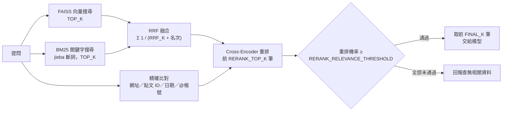
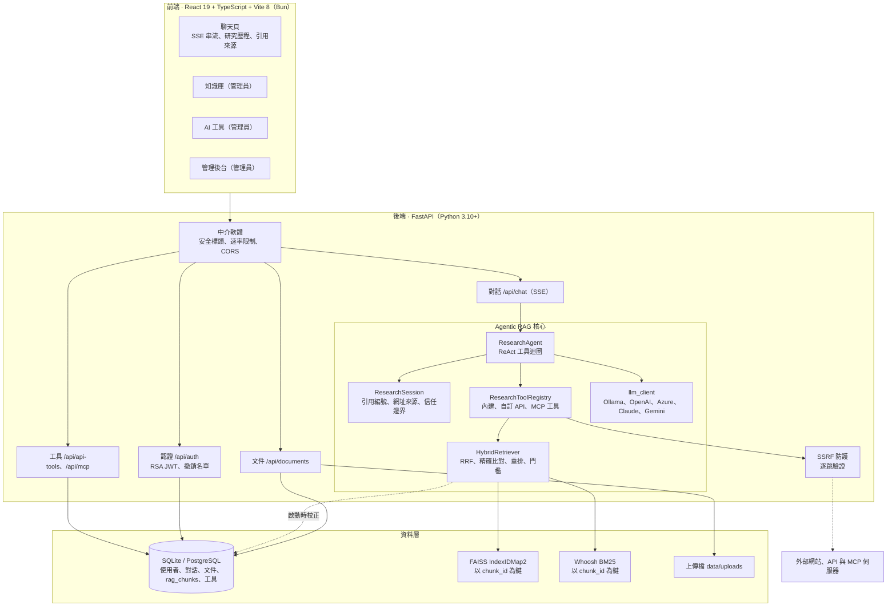
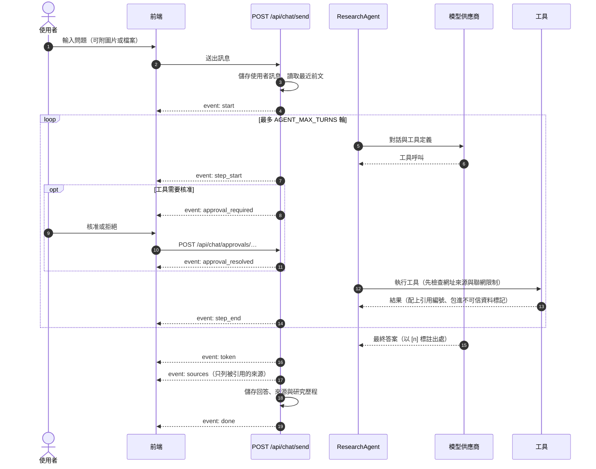

<div align="center">


# AskMiao

**會自己查證、答案附出處的企業知識庫對話系統**

以混合檢索（FAISS + BM25 + Cross-Encoder）與 Agentic RAG 自主研究回答問題，<br>答案中的每個論點都能追溯到文件段落或網頁；知識庫查不到時照實說。

[繁體中文](README.md) | [English](README_en.md)

[](CHANGELOG.md)
[](https://www.python.org/)
[](https://fastapi.tiangolo.com/)
[](https://react.dev/)
[](https://www.typescriptlang.org/)
[](https://vite.dev/)
[](https://bun.sh/)
[](LICENSE)

[介紹網站](https://scorpio-meow.github.io/AskMiao/) · [快速開始](#快速開始) · [文件導覽](#文件導覽) · [版本變更紀錄](CHANGELOG.md) · [升級指南](docs/upgrading.md)

</div>

<br>

<picture>
  <source media="(prefers-color-scheme: dark)" srcset="site/assets/screens/hero-chat-dark.webp">
  
</picture>

> [!IMPORTANT]
> **4.0.0 含破壞性變更**：移除 `JWT_SECRET_KEY` 與 `JWT_ALGORITHM`、RSA 金鑰改為必要、compose 需設定 `POSTGRES_PASSWORD`、開發伺服器只接受本機連線、有副作用的工具呼叫需使用者核准。升級前請先閱讀 [升級指南](docs/upgrading.md)。

## 目錄

- [特色一覽](#特色一覽)
- [4.0.0 重點](#400-重點)
- [功能特色](#功能特色)
- [畫面預覽](#畫面預覽)
- [系統架構](#系統架構)
- [快速開始](#快速開始)
- [設定](#設定)
- [專案結構](#專案結構)
- [開發與測試](#開發與測試)
- [疑難排解](#疑難排解)
- [文件導覽](#文件導覽)
- [版本資訊](#版本資訊)
- [貢獻指南](#貢獻指南)
- [授權條款](#授權條款)

---

## 特色一覽

| | 能力 | 說明 |
|---|---|---|
| 1 | **答案可追溯** | 答案以 `[n]` 標註出處，來源標籤只列實際引用的文件段落或網頁，點開即可核對原文 |
| 2 | **查不到就照實說** | 重排機率低於門檻的片段一律濾除，全部未通過時明確回報「知識庫中查無相關資料」，不硬湊答案 |
| 3 | **自主研究** | ReAct Agent 自行決定查知識庫、精確統計記錄、上網搜尋或深入閱讀網頁，研究歷程即時顯示 |
| 4 | **混合檢索** | 向量與 BM25 每次必跑，以 RRF 依名次融合，再由 Cross-Encoder 重排；片段以資料庫 chunk_id 為準 |
| 5 | **五家模型供應商** | Ollama、OpenAI、Azure OpenAI、Anthropic Claude、Google Gemini 都能呼叫工具與串流 |
| 6 | **外部工具與 MCP** | 貼上 OpenAPI 規格即可匯入 API 工具，也能接入 MCP 伺服器；只限管理員管理，有副作用的呼叫先經使用者核准 |
| 7 | **防護完整** | RSA JWT、Argon2 密碼雜湊、逐跳 SSRF 驗證並固定連線 IP、工具輸出信任邊界、資源上限、對外只回錯誤代碼 |

## 4.0.0 重點

4.0.0 以安全稽核為主軸，處理了 52 項線索。對日常使用影響最大的是「有副作用的工具要先核准」，對部署影響最大的是 RSA 金鑰與 `POSTGRES_PASSWORD` 改為必要。

| 面向 | 改變 | 升級時要做的事 |
|---|---|---|
| 工具呼叫 | 有副作用的自訂 API 工具與 MCP 工具，Agent 呼叫前暫停，由發問者在對話中核准；300 秒未回應視為拒絕 | 到「AI 工具」頁檢查每個工具的「需要核准」設定 |
| 認證 | 權杖每次請求對應資料庫帳號，停用、刪除或降權立即生效；重新整理權杖只能用一次；移除 HS256 退路 | 從 `.env` 刪除 `JWT_SECRET_KEY`、`JWT_ALGORITHM`，確認 `backend/keys/` 可讀寫 |
| 出站請求 | 驗證後把連線固定在核可的 IP，擋下 DNS rebinding；`web_fetch` 改以正規化後的完整網址比對來源 | 不需處理 |
| 資源用量 | 請求本文、訊息、附件、工具結果、同時串流數與附件儲存量都有上限 | 用戶端需處理 `413`、`422`、`429` |
| 部署 | compose 的 PostgreSQL 需要 `POSTGRES_PASSWORD` 且只綁定本機；Vite 開發伺服器只監聽 `localhost`；預設不採信 `X-Forwarded-For` | 設定 `POSTGRES_PASSWORD`；在反向代理後方時設定 `FORWARDED_ALLOW_IPS` |
| API | 訊息的 `context_used` 一律為 `null`；`GET /api/chat/tools` 需要登入；`model_name` 必須在可用清單內 | 依 [API 參考](docs/api.md) 調整用戶端 |

完整變更見 [CHANGELOG 4.0.0](CHANGELOG.md#400---2026-09-27)，逐步操作見 [升級指南](docs/upgrading.md#從-300-升級到-400)。

## 功能特色

### Agentic RAG 自主研究

- **ReAct 研究迴圈**：`ResearchAgent` 以原生工具呼叫（Native Tool Calling）多輪蒐集資料，輪數上限由 `AGENT_MAX_TURNS` 控制；模型不再呼叫工具時，該次內容就是最終答案。
- **四個內建工具**：

  | 工具 | 用途 |
  |---|---|
  | `search_knowledge_base` | 檢索知識庫片段，可用 `target_document` 限定文件 |
  | `filter_and_count_records` | 依日期、作者、關鍵字精確統計結構化記錄（例如某月的貼文總數） |
  | `web_search` | 聯網搜尋，設定 `OLLAMA_API_KEY` 時優先使用 Ollama Web Search，否則使用 DuckDuckGo |
  | `web_fetch` | 深入閱讀網頁全文，只能讀取使用者訊息或本次工具結果中原樣出現過的網址 |

- **研究歷程**：每一步的工具、參數、結果摘要與耗時以 SSE 即時推送，前端以可折疊時間軸呈現。
- **多模態提問**：對話可附圖片與檔案（每則最多 5 個、單檔 15 MiB、合計 20 MiB），圖片以 `image_url` 交給視覺模型，文字類附件抽取內容併入提問。
- **對話前文**：每次提問從資料庫帶入最近 `CONVERSATION_HISTORY_MESSAGES` 則訊息，後端重啟不會遺失上下文。

### 可追溯的答案

- 每次提問建立一張引用編號表：知識庫片段以 chunk_id、網頁以網址為鍵，第一次出現時配號，模型以 `[n]` 標註出處。
- 來源標籤只列答案實際引用的條目，依第一次引用的順序排列，例如「[2] 員工手冊.pdf（段落 3）」；沒有引用就不顯示來源。
- 工具結果一律包在每次提問 id 不同的 `<untrusted_tool_result>` 標記內，模型只把它當資料看，文件或網頁中夾帶的指令不會被執行。

### 混合檢索引擎


```mermaid
flowchart LR
    Q["提問"] --> V["FAISS 向量搜尋<br/>TOP_K"]
    Q --> B["BM25 關鍵字搜尋<br/>jieba 斷詞，TOP_K"]
    Q --> E["精確比對<br/>網址／貼文 ID／日期／@帳號"]
    V --> F["RRF 融合<br/>Σ 1 / (RRF_K + 名次)"]
    B --> F
    F --> R["Cross-Encoder 重排<br/>前 RERANK_TOP_K 筆"]
    E --> R
    R --> T{"重排機率 ≥<br/>RERANK_RELEVANCE_THRESHOLD"}
    T -->|通過| K["取前 FINAL_K 筆<br/>交給模型"]
    T -->|全部未通過| N["回報查無相關資料"]
```

- **兩軌必跑**：只有單一軌道找到的片段也能進入重排候選，專有名詞與代碼查詢不再被淹沒。
- **相關性門檻看重排機率**：精確比對到網址、貼文 ID、日期的片段不受門檻限制，並排在最前面。
- **以資料庫為準**：片段存於 `rag_chunks` 資料表，FAISS（`IndexIDMap2`）與 BM25 皆以 chunk_id 對應；後端啟動時自動校正兩份索引，刪除文件只移除該文件的向量。
- **可量測**：`scripts/evaluate_retrieval.py` 以問答集計算 hit@k、recall@k、MRR 與反例拒絕率，並能一次比較多個門檻。

### 多供應商 LLM

- 統一呼叫層支援 **Ollama、OpenAI、Azure OpenAI v1、Anthropic Claude（官方 SDK）、Google Gemini**，依模型名稱自動路由，五家都支援工具呼叫與串流。
- 前端可切換模型與五檔推理程度：`無 (None)`、`輕度 (Low)`、`標準 (Medium)`、`深度 (High)`、`極致 (X-High)`；推理程度會傳給 OpenAI 與 Azure OpenAI 的推理模型。
- 模型清單可由 `AVAILABLE_MODELS` 指定，或依已設定的金鑰自動產生，詳見 [設定參考](docs/configuration.md#llm-供應商與模型)。

### 知識庫與文件處理

- 支援 27 種副檔名：`.txt`、`.md`、`.markdown`、`.pdf`、`.docx`、`.pptx`、`.xlsx`、`.csv`、`.json`、`.yaml`、`.yml`、`.xml`、`.html`、`.htm`、`.log`、`.py`、`.js`、`.ts`、`.tsx`、`.jsx`、`.java`、`.cpp`、`.c`、`.sql`、`.sh`、`.ini`、`.env`。
- **PDF 強化擷取**：PyMuPDF 擷取並修復缺少 ToUnicode 的內嵌字型；空白或亂碼頁改以視覺模型 OCR（Azure OpenAI、OpenAI 或 Gemini），最後以 pypdf 備援。
- **智慧切塊**：Q&A 文件一問一答成一個片段，結構化記錄與 JSON 逐筆成為獨立片段，其餘依中文標點遞迴切塊。
- **AI 大綱與摘要**：上傳時自動生成文件摘要，可重新生成或手動修訂；LLM 失敗時改用規則摘要。摘要也會組成知識庫目錄，幫助 Agent 判斷該查哪份文件。

### 外部工具與 MCP

- **自訂 API 工具**：以表單建立，或貼上 OpenAPI / Swagger 規格（OAS 2.0、3.0、3.1）批次匯入，支援 Bearer、API Key（Header / Query）與 Basic 認證，可即時測試。
- **MCP 用戶端**：支援 `stdio` 與 HTTP 傳輸，自動探索工具並以 `mcp_<伺服器>_<工具>` 名稱加入 Agent 工具集；內建時間與檔案系統兩個範本（檔案系統範本只開放專屬沙箱目錄 `backend/mcp_filesystem_sandbox`）。
- **動態載入**：啟用中的工具在每次組裝工具定義時從資料庫載入，變更後不需重啟。
- **呼叫前核准**：有副作用的工具由發問者在對話中核准後才執行，見下方 [工具呼叫核准](#工具呼叫核准)。
- **只限管理員**：工具由所有使用者的 Agent 共用，`/api/api-tools`、`/api/mcp` 與「AI 工具」頁只開放管理員；`stdio` 子行程只繼承 `PATH` 等系統變數，拿不到後端的金鑰，關閉時連同整個子行程樹一起終止（[ADR-0004](docs/adr/0004-tool-admin-permissions-and-subprocess-isolation.md)）。

### 工具呼叫核准

Agent 可以自己查資料，但不會自己替你送出申請、刪除紀錄或呼叫會寫入的 API。標記為「需要核准」的工具被呼叫時：

1. 串流送出 `approval_required`（含 `approval_id`、工具顯示名稱與參數），Agent 暫停。
2. 回答中出現確認卡片，原樣列出工具與參數。
3. 發問者按下「核准執行」或「拒絕」，前端呼叫 `POST /api/chat/approvals/{approval_id}`，串流接著送出 `approval_resolved`。
4. 核准才執行；拒絕或 300 秒未回應時，模型收到「使用者未核准」，並被要求不要再次呼叫同一工具。

| 工具類型 | 預設 | 說明 |
|---|---|---|
| 內建工具（`search_knowledge_base` 等 4 個） | 不需要 | 只讀取資料，由網址來源與 SSRF 規則把關 |
| 自訂 API 工具，方法為 `GET`、`HEAD`、`OPTIONS` | 不需要 | 管理員仍可為個別工具勾選「需要核准」 |
| 自訂 API 工具，其他方法 | 需要 | 升級到 4.0.0 時，既有工具依 HTTP 方法自動回填 |
| MCP 伺服器 | 需要 | 以伺服器為單位設定，卡片顯示「伺服器 → 工具」 |

- 待核准項目綁定發問者，其他帳號以同一個 `approval_id` 回覆會得到 `404`。
- 不是由使用者在對話中發起的 Agent 呼叫沒有人能核准，這類工具一律不執行。
- 設計背景與取捨見 [ADR-0006](docs/adr/0006-tool-call-approval.md)；[介紹網站](https://scorpio-meow.github.io/AskMiao/#approval) 有可操作的示範。

### 安全設計

- **認證**：RSA-2048 簽署的 JWT 存取權杖（RSA 金鑰無法載入時拒絕啟動），每次請求都以資料庫中的帳號狀態與權限為準；重新整理權杖存於 HttpOnly Cookie 且只能使用一次；登出時兩者寫入撤銷名單；密碼以 Argon2 雜湊（舊的 bcrypt 雜湊在登入時自動升級）。
- **出站請求**：OpenAPI 規格網址、`web_fetch`、自訂 API 工具與 MCP HTTP 傳輸都經 `ssrf_protection.py` 驗證，每一次轉址都重新檢查並把連線固定在驗證過的 IP，阻擋內網、雲端中繼資料端點與危險連接埠。
- **資源上限**：請求本文、訊息長度、附件數量與大小、工具結果、同時串流數與附件儲存量都有上限，詳見 [資源上限](docs/configuration.md#資源上限)。
- **錯誤代碼**：未預期例外只對外回傳隨機錯誤代碼，完整堆疊只寫入伺服器日誌（CWE-209 / CWE-497）。
- **日誌脫敏**：物件遞迴與正規表示式雙層遮罩，密碼、權杖與 Authorization 標頭一律呈現為 `[REDACTED]`。
- **其他**：安全回應標頭、依來源 IP 的速率限制（預設不採信 `X-Forwarded-For`，信任的反向代理以 `FORWARDED_ALLOW_IPS` 指定）、CORS 白名單、檔名與路徑遍歷檢查、前端反點擊劫持。

#### 防護對照

| 威脅 | 防護 | 位置 |
|---|---|---|
| 文件或網頁夾帶提示注入 | 工具結果包在每次提問 id 不同的 `<untrusted_tool_result>` 標記內；`web_fetch` 只能讀使用者訊息或本次工具結果中出現過的完整網址 | `rag/research_session.py` |
| SSRF 與 DNS rebinding | 協定、連接埠、主機名稱、IP 與 DNS 結果逐跳驗證，連線固定在核可的 IP | `core/ssrf_protection.py` |
| Agent 擅自改動外部系統 | 有副作用的工具呼叫前由發問者核准 | `rag/tool_approval.py` |
| 工具設定被濫用 | 工具管理只限管理員；`stdio` 子行程不繼承後端金鑰 | `api/api_tools.py`、`api/mcp.py`、`services/mcp_service.py` |
| 帳號停用後權杖仍有效 | 每次請求依 `sub` 讀取帳號狀態與角色，重新整理權杖只能使用一次 | `core/jwt_auth.py`、`api/auth.py` |
| 資源耗盡 | 請求本文、附件、工具結果、串流數與密碼雜湊數都有上限 | `core/limits.py`、`core/body_limit.py` |
| 內部資訊外洩 | 對外只回錯誤代碼，日誌雙層脫敏並限制欄位長度 | `core/error_response.py`、`core/security_logging.py` |

#### 主要資源上限

| 項目 | 上限 | 超過時 |
|---|---|---|
| 一般請求本文 | 1 MiB（帶有效權杖的聊天送出與文件上傳另計） | `413` |
| 單則聊天訊息 | 20,000 字 | `422` |
| 每則訊息的附件 | 5 個，單檔 15 MiB、合計 20 MiB | `422` |
| 每位使用者的附件儲存量 | 200 MiB | `413` |
| 每位使用者同時進行的回答串流 | 2 個 | `429` |
| 單次工具結果放進模型 | 20,000 字 | 截斷 |
| 待核准的工具呼叫 | 300 秒 | 視為拒絕 |

完整清單見 [資源上限](docs/configuration.md#資源上限)。

### 前端體驗

- 串流中可停止回答、失敗可重新傳送；注音與倉頡等輸入法按 Enter 選字不會誤送。
- 淺色、深色與跟隨系統三種外觀，第一次繪製前套用，不會閃白。
- 鍵盤與讀螢幕軟體可完整操作，文字對比達 WCAG AA；手機版面單列頂欄、聊天頁固定一個視窗高度。
- 刪除前一律確認，網路離線與恢復時提示，非管理員進入管理頁時顯示「沒有權限」頁面。
- 回答中的 Markdown 圖片顯示為點擊後才在新分頁開啟的連結，不會自動向外部主機載入。

## 畫面預覽

<table>
  <tr>
    <td width="33%" valign="top">
      <picture>
        <source media="(prefers-color-scheme: dark)" srcset="site/assets/screens/feature-trace-dark.webp">
        
      </picture>
      <p align="center"><b>研究歷程</b><br>每一步的工具、參數與結果</p>
    </td>
    <td width="33%" valign="top">
      <picture>
        <source media="(prefers-color-scheme: dark)" srcset="site/assets/screens/feature-docs-dark.webp">
        
      </picture>
      <p align="center"><b>知識庫管理</b><br>上傳、AI 摘要與重建索引</p>
    </td>
    <td width="33%" valign="top">
      <picture>
        <source media="(prefers-color-scheme: dark)" srcset="site/assets/screens/feature-tools-dark.webp">
        
      </picture>
      <p align="center"><b>AI 工具</b><br>OpenAPI 匯入與 MCP 伺服器</p>
    </td>
  </tr>
</table>

> 截圖以真實前端搭配示範資料擷取，畫面中的文件、對話與數字皆為示範用途。

## 系統架構


```mermaid
flowchart TB
    subgraph Client ["前端 · React 19 + TypeScript + Vite 8（Bun）"]
        ChatUI["聊天頁<br/>SSE 串流、研究歷程、引用來源"]
        DocsUI["知識庫（管理員）"]
        ToolsUI["AI 工具（管理員）"]
        AdminUI["管理後台（管理員）"]
    end

    subgraph Backend ["後端 · FastAPI（Python 3.10+）"]
        MW["中介軟體<br/>安全標頭、速率限制、CORS"]
        Auth["認證 /api/auth<br/>RSA JWT、撤銷名單"]
        ChatAPI["對話 /api/chat（SSE）"]
        DocAPI["文件 /api/documents"]
        ToolAPI["工具 /api/api-tools、/api/mcp"]

        subgraph Core ["Agentic RAG 核心"]
            Agent["ResearchAgent<br/>ReAct 工具迴圈"]
            Session["ResearchSession<br/>引用編號、網址來源、信任邊界"]
            Registry["ResearchToolRegistry<br/>內建、自訂 API、MCP 工具"]
            Retriever["HybridRetriever<br/>RRF、精確比對、重排、門檻"]
            LLM["llm_client<br/>Ollama、OpenAI、Azure、Claude、Gemini"]
        end

        SSRF["SSRF 防護<br/>逐跳驗證"]
    end

    subgraph Storage ["資料層"]
        DB[("SQLite / PostgreSQL<br/>使用者、對話、文件、rag_chunks、工具")]
        FAISS["FAISS IndexIDMap2<br/>以 chunk_id 為鍵"]
        BM25["Whoosh BM25<br/>以 chunk_id 為鍵"]
        Files["上傳檔 data/uploads"]
    end

    Client --> MW
    MW --> Auth & ChatAPI & DocAPI & ToolAPI
    ChatAPI --> Agent
    Agent --> Session
    Agent --> Registry
    Agent --> LLM
    Registry --> Retriever
    Registry --> SSRF
    SSRF -.-> Ext["外部網站、API 與 MCP 伺服器"]
    Retriever --> FAISS & BM25
    DocAPI --> Files
    DocAPI --> DB
    Retriever -.->|啟動時校正| DB
    Auth --> DB
    ToolAPI --> DB
```

一次提問的完整旅程：


```mermaid
sequenceDiagram
    autonumber
    actor U as 使用者
    participant FE as 前端
    participant API as POST /api/chat/send
    participant AG as ResearchAgent
    participant LLM as 模型供應商
    participant T as 工具

    U->>FE: 輸入問題（可附圖片或檔案）
    FE->>API: 送出訊息
    API->>API: 儲存使用者訊息、讀取最近前文
    API-->>FE: event: start
    loop 最多 AGENT_MAX_TURNS 輪
        AG->>LLM: 對話與工具定義
        LLM-->>AG: 工具呼叫
        API-->>FE: event: step_start
        opt 工具需要核准
            API-->>FE: event: approval_required
            U->>FE: 核准或拒絕
            FE->>API: POST /api/chat/approvals/…
            API-->>FE: event: approval_resolved
        end
        AG->>T: 執行工具（先檢查網址來源與聯網限制）
        T-->>AG: 結果（配上引用編號、包進不可信資料標記）
        API-->>FE: event: step_end
    end
    LLM-->>AG: 最終答案（以 [n] 標註出處）
    API-->>FE: event: token
    API-->>FE: event: sources（只列被引用的來源）
    API->>API: 儲存回答、來源與研究歷程
    API-->>FE: event: done
```

各模組的設計細節見 [系統架構與設計](docs/architecture.md)。

## 快速開始

### 環境需求

| 項目 | 需求 | 說明 |
|---|---|---|
| Python | 3.10 以上 | 後端 |
| Bun | 1.x | 前端套件管理、開發伺服器與建置 |
| 資料庫 | SQLite（Python 內建）或 PostgreSQL | 預設可零依賴使用 SQLite |
| 模型 | 首次啟動下載約 1.2 GB | 嵌入模型 `BAAI/bge-small-zh-v1.5` 與重排模型 `BAAI/bge-reranker-base` |
| LLM | 擇一 | 本機 Ollama，或 OpenAI、Azure OpenAI、Anthropic、Gemini 的 API 金鑰 |

### 1. 取得原始碼

```bash
git clone https://github.com/Scorpio-meow/AskMiao.git
cd AskMiao
```

### 2. 設定並啟動後端

```bash
cd backend

# 建立並啟用虛擬環境（Windows 可用 py -m venv .venv）
python -m venv .venv
# Windows PowerShell
.\.venv\Scripts\Activate.ps1
# Linux / macOS
source .venv/bin/activate

pip install -r requirements.txt
cp .env.example .env
```

啟動前先編輯 `backend/.env`：

1. **資料庫**：範本的 `DATABASE_URL` 指向 PostgreSQL；零依賴啟動請改為 `DATABASE_URL=sqlite:///./chatbot.db`。
2. **金鑰**：把 `ADMIN_API_KEY` 換成隨機字串，可用 `python -c "import secrets; print(secrets.token_urlsafe(32))"` 產生。JWT 一律以 `backend/keys/` 的 RSA 金鑰簽署，不需要另設簽署密鑰。
3. **模型**：使用本機 Ollama 時保持 `LLM_API_BASE=http://localhost:11434`；使用雲端模型時填入對應的 API 金鑰，使用 Claude 另需 `ANTHROPIC_MAX_TOKENS`。

範本已包含其餘必填設定，保持範本值即可啟動。接著啟動後端：

```bash
python main.py
```

首次啟動會自動建立資料表、產生 JWT 用的 RSA 金鑰（`backend/keys/`，後端帳號需能寫入；金鑰無法載入時後端拒絕啟動），並下載嵌入與重排模型。啟動完成後：

- API：`http://localhost:8001`
- 互動式 API 文件（Swagger UI）：`http://localhost:8001/docs`

> [!NOTE]
> `init_db.py` 是替舊版 PostgreSQL 資料庫補欄位與索引的相容腳本，全新安裝不需要執行；SQLite 也不支援其中的 `ADD COLUMN IF NOT EXISTS` 語法。

### 3. 啟動前端

開啟另一個終端機：

```bash
cd frontend
bun install
bun run dev
```

以瀏覽器開啟 `http://localhost:3000`。沒有 `frontend/.env` 時，前端呼叫相對路徑 `/api`，由 Vite 開發伺服器代理到 `http://127.0.0.1:8001`，不需要設定 CORS。若複製了 `frontend/.env.example`（`PORT=3001`、直接呼叫後端），改開 `http://localhost:3001`。

> [!NOTE]
> Vite 開發與預覽伺服器只監聽 `localhost`，區網內的其他裝置連不上。需要讓其他裝置使用時，請以 `bun run build` 建置，再由正式的網頁伺服器提供 `frontend/build/` 並反向代理 `/api`。

### 4. 建立第一位管理員

「知識庫」、「AI 工具」與「管理後台」只限管理員，而系統不會預先建立管理員帳號：

1. 在前端「註冊」頁建立帳號。密碼至少 8 個字元，需包含大寫字母、小寫字母與數字。
2. 在 `backend/`（已啟用虛擬環境）執行下列指令，把 `your_username` 換成剛註冊的使用者名稱：

   ```bash
   python -c "from sqlalchemy import text; from app.models.database import engine; conn = engine.connect(); conn.execute(text('UPDATE users SET is_admin = :flag WHERE username = :name'), {'flag': True, 'name': 'your_username'}); conn.commit()"
   ```

3. 登出後重新登入，導覽列就會出現管理功能。之後可在「管理後台」直接把其他使用者設為管理員。

這個指令透過後端的資料庫設定執行，SQLite 與 PostgreSQL 都適用。

### 5. 上傳文件並開始提問

1. 以管理員進入「知識庫」，上傳文件（單次最多 10 個檔案，單檔上限由 `MAX_FILE_SIZE_MB` 決定）。系統會擷取文字、生成 AI 摘要並建立索引。
2. 回到「聊天」，選擇模型與推理程度後提問。答案中的 `[n]` 可對應下方的來源標籤。

### 使用 PostgreSQL（選用）

`backend/docker-compose.yml` 提供 PostgreSQL 17，初始化時會套用 `init.sql`。先在 `backend/.env` 設定資料庫超級使用者的密碼（必填，未設定時 compose 拒絕啟動），並讓 `DATABASE_URL` 使用同一組密碼：

```dotenv
POSTGRES_PASSWORD=<隨機字串>
DATABASE_URL=postgresql+psycopg2://postgres:<同一組隨機字串>@localhost:7690/chatbot
```

接著啟動容器：

```bash
cd backend
docker compose up -d
```

容器只在本機回送位址 `127.0.0.1:7690` 開放，區網與公網都連不到。密碼含 `@`、`:`、`/` 等字元時，`DATABASE_URL` 中需改寫成百分比編碼。

## 設定

後端設定集中在 `backend/.env`，以下 10 項沒有預設值，缺少任一項後端就無法啟動（範本已提供建議值）：

| 變數 | 範本值 | 說明 |
|---|---|---|
| `DATABASE_URL` | PostgreSQL 範例 | 資料庫連線字串；SQLite 用 `sqlite:///./chatbot.db` |
| `ADMIN_API_KEY` | 佔位字串 | 管理用 API 金鑰（目前沒有路由使用，但設定驗證要求此值） |
| `ENABLE_WEB_SEARCH` | `true` | 是否提供 `web_search` 與 `web_fetch` |
| `AGENT_MAX_TURNS` | `5` | 單次提問的工具呼叫輪數上限（≥ 1） |
| `CONVERSATION_HISTORY_MESSAGES` | `6` | 帶入的前文訊息數（0 表示不帶） |
| `WEB_FETCH_ALLOWED_DOMAINS` | `*` | `web_fetch` 可讀取的網域；明確寫 `*` 才表示不限制 |
| `BLOCK_WEB_TOOLS_AFTER_KB` | `true` | 讀過知識庫內容後停用聯網工具 |
| `RRF_K` | `60` | RRF 融合常數 |
| `RERANK_RELEVANCE_THRESHOLD` | `0.2` | 重排機率門檻（暫定值，建議以問答集校準） |
| `DOMAIN_PROFILE_PATH` | `config/domain_profile.json` | 領域設定檔（領域詞、日期欄位、摘要備援規則） |

常用的選填設定：

| 變數 | 說明 |
|---|---|
| `LLM_API_BASE` | Ollama 服務位址（範本 `http://localhost:11434`） |
| `OPENAI_API_KEY`、`AZURE_OPENAI_*`、`ANTHROPIC_API_KEY`、`GEMINI_API_KEY` | 雲端模型金鑰；設定後自動加入模型清單 |
| `ANTHROPIC_MAX_TOKENS` | Claude 單次回應的輸出上限（使用 Claude 時必填） |
| `MODEL_NAME`、`AVAILABLE_MODELS` | 預設模型與自訂模型清單 |
| `CHUNK_SIZE`、`CHUNK_OVERLAP` | 切塊長度與重疊（範本 300 / 100） |
| `HF_HOME`、`HF_HUB_OFFLINE` | 模型快取位置與離線模式 |
| `ALLOWED_ORIGINS` | CORS 允許來源（前端直接呼叫後端時需要） |
| `FORWARDED_ALLOW_IPS` | 會覆寫 `X-Forwarded-For` 的反向代理位址；未設定時速率限制以實際連線對端計算 |

所有設定（含預設值、範本值、供應商路由規則、資源上限與前端環境變數）請見 **[設定參考](docs/configuration.md)**。

## 專案結構

```text
AskMiao/
├── backend/                          # FastAPI 後端
│   ├── main.py                       # 進入點（python main.py）
│   ├── app/
│   │   ├── __init__.py               # 後端版本號 __version__
│   │   ├── api/                      # 路由：auth、chat、documents、api_tools、mcp、admin、tags
│   │   ├── core/                     # 設定、認證、安全與 LLM 呼叫層
│   │   │   ├── config.py             # Settings：所有環境變數與驗證規則
│   │   │   ├── lifespan.py           # 啟動流程：建表、初始化 RAG、上傳檔監看
│   │   │   ├── llm_client.py         # 五家供應商的統一呼叫層（工具呼叫、串流）
│   │   │   ├── jwt_auth.py           # RSA JWT、Argon2 密碼雜湊、撤銷名單檢查
│   │   │   ├── limits.py             # 資源上限常數（請求本文、附件、工具結果、日誌等）
│   │   │   ├── body_limit.py         # 請求本文大小上限中介層
│   │   │   ├── ssrf_protection.py    # 出站網址驗證、逐跳 SSRF 檢查與連線 IP 固定
│   │   │   ├── error_response.py     # 對外錯誤代碼
│   │   │   ├── security_logging.py   # 日誌雙層脫敏
│   │   │   └── domain_profile.py     # 領域設定檔載入與驗證
│   │   ├── models/                   # SQLAlchemy 資料表與 Pydantic 請求模型
│   │   ├── rag/                      # 檢索與 Agentic RAG 核心
│   │   │   ├── contextual_rag.py     # HybridContextualRAG：索引校正、寫入與檢索的門面
│   │   │   ├── agent.py              # ResearchAgent：ReAct 工具迴圈與串流事件
│   │   │   ├── research_session.py   # 單次提問的引用編號、網址來源限制與不可信資料包裝
│   │   │   ├── tools.py              # 內建工具與自訂 API / MCP 工具的註冊與執行
│   │   │   ├── tool_approval.py      # 有副作用工具的對話內核准
│   │   │   ├── pipeline.py           # 切塊與 Agent 串流管線
│   │   │   ├── tokenizers.py         # jieba 斷詞與斷詞簽章
│   │   │   ├── evaluator.py          # 檢索評估（hit@k、MRR、反例拒絕率）
│   │   │   ├── indices/              # chunk_store（rag_chunks）、vector_store（FAISS）、bm25_store
│   │   │   └── retrievers/hybrid.py  # RRF 融合、精確比對、重排與相關性門檻
│   │   ├── services/                 # 對話、文件處理（含 PDF OCR）、OpenAPI 解析、MCP 用戶端
│   │   └── tasks/uploads_watcher.py  # 上傳檔遺失監看（只記警告）
│   ├── config/domain_profile.json    # 領域設定檔
│   ├── eval/                         # 檢索評估問答集
│   ├── scripts/                      # 維運腳本
│   ├── tests/                        # pytest 測試
│   ├── docker-compose.yml            # 選用的 PostgreSQL 17（本機 127.0.0.1:7690，需設 POSTGRES_PASSWORD）
│   ├── init.sql                      # PostgreSQL 初始化結構
│   ├── init_db.py                    # 舊版 PostgreSQL 資料庫的相容補丁
│   ├── requirements.txt
│   └── .env.example                  # 後端設定範本
├── frontend/                         # React 19 + TypeScript + Vite 8
│   ├── src/
│   │   ├── pages/                    # Chat/、Documents、AiTools、AdminDashboard、登入、註冊、個人資料
│   │   ├── components/               # Layout、路由守衛與 ui/ 元件庫
│   │   ├── hooks/                    # useChat（串流、停止與重送）、useAuth、useDocuments
│   │   ├── services/                 # api.ts（Axios 與權杖更新）、sse.ts（SSE 解析器）
│   │   ├── contexts/ThemeContext.tsx # 淺色／深色／跟隨系統
│   │   └── styles/                   # 設計 token 與 reset
│   ├── package.json                  # 前端版本號與指令
│   └── .env.example
├── site/                             # GitHub Pages 介紹頁（純靜態）
├── docs/
│   ├── api.md                        # API 參考
│   ├── architecture.md               # 系統架構與設計
│   ├── configuration.md              # 設定參考
│   ├── upgrading.md                  # 升級指南
│   └── adr/                          # 架構決策紀錄
├── .github/workflows/deploy-pages.yml # site/ 有變更時部署到 GitHub Pages
├── llms.txt                          # 給 AI Agent 的專案導覽
├── CHANGELOG.md                      # 版本變更紀錄
└── LICENSE
```

每份文件都有 `_en` 結尾的英文版。

## 開發與測試

### 後端測試

```bash
cd backend
python -m pytest
```

- 測試會載入設定，必填設定須存在於 `backend/.env` 或環境變數中。
- 部分測試會載入實際的嵌入與重排模型（需要模型快取），完整執行約需數分鐘。
- Windows 使用者名稱含中文等非 ASCII 字元時，請加上 `--basetemp=C:\pytest-tmp` 之類的 ASCII 路徑，否則 FAISS 寫入暫存索引會失敗。

### 前端檢查

```bash
cd frontend
bun run test --run   # Vitest 單元測試（SSE 解析器）
bun run lint         # ESLint（JS / JSX）
bun x tsc --noEmit   # TypeScript 型別檢查
bun run build        # 產出 build/
```

### 維運腳本

在 `backend/` 以 `python scripts/<腳本>` 執行：

| 腳本 | 用途 |
|---|---|
| `evaluate_retrieval.py` | 以問答集評估檢索品質並比較相關性門檻（唯讀，可與後端同時執行），見 [校準相關性門檻](docs/configuration.md#校準相關性門檻) |
| `reprocess_existing_docs.py` | 離線重建：重新擷取文字、生成摘要、切塊並寫入索引。請先停止後端 |
| `reset_faiss.py` | 刪除 `backend/data` 內的 FAISS 與 BM25 索引檔，再依 `rag_chunks` 重新計算（會先詢問確認） |
| `test_llm_clients.py` | 以模擬回應檢查模型清單與各供應商的呼叫格式，不會真的呼叫 API |
| `docx_to_txt.py` | 把上傳目錄中的 `.docx` 轉成 `.txt` |
| `migrate_sqlite_to_postgres.py` | 已知問題：引用了已移除的 `app.models.custom_agent`，目前無法執行 |

## 疑難排解

<details>
<summary><b>後端啟動失敗，出現 <code>Field required</code></b></summary>

`.env` 缺少必填設定，錯誤訊息會列出欄位名稱。對照 [設定](#設定) 補上即可；從 2.x 升級請參考 [升級指南](docs/upgrading.md)。

</details>

<details>
<summary><b>後端啟動失敗，錯誤與 RSA 金鑰或 <code>backend/keys</code> 有關</b></summary>

JWT 一律以 RSA 金鑰簽署，金鑰無法載入或產生時後端拒絕啟動，不再退回共用密鑰。請確認 `backend/keys/` 內的 `jwt_private.pem`、`jwt_public.pem` 完整可讀；首次啟動時該目錄需要能讓後端帳號寫入。

</details>

<details>
<summary><b>後端啟動失敗，訊息為「無法載入重排模型」</b></summary>

重排模型是必要元件。首次啟動需要連上 Hugging Face 下載模型，請確認網路可用且 `HF_HUB_OFFLINE` 不是 `true`；已下載過模型時，確認 `HF_HOME` 指向原本的快取目錄。

</details>

<details>
<summary><b>執行 <code>python init_db.py</code> 出現 <code>near "EXISTS": syntax error</code></b></summary>

使用 SQLite 時不需要執行 `init_db.py`，資料表會在後端啟動時自動建立。這個腳本只用於替舊版 PostgreSQL 資料庫補欄位與索引。

</details>

<details>
<summary><b>登入後看不到「知識庫」、「AI 工具」與「管理後台」</b></summary>

這些頁面只限管理員。請依 [建立第一位管理員](#4-建立第一位管理員) 設定後重新登入。

</details>

<details>
<summary><b>每個問題都回報「知識庫中查無相關資料」</b></summary>

先確認已上傳文件，且管理員呼叫 `GET /api/admin/vector-store/info` 時 `total_vectors` 大於 0。索引正常時，可能是相關性門檻太高，請依 [校準相關性門檻](docs/configuration.md#校準相關性門檻) 以實際問答集調整。

</details>

<details>
<summary><b>前端出現網路錯誤或 CORS 錯誤</b></summary>

- 沒有 `frontend/.env` 時，前端經 Vite 代理連到 `http://127.0.0.1:8001`，請確認後端已在該埠啟動。
- 設定了 `VITE_API_BASE` 等絕對網址時，瀏覽器會直接呼叫後端，後端的 `ALLOWED_ORIGINS` 必須包含前端的來源（例如 `http://localhost:3001`）。

</details>

<details>
<summary><b>區網內的其他裝置連不上 <code>bun run dev</code> 的前端</b></summary>

Vite 開發與預覽伺服器只監聽 `localhost`，這是刻意的限制（開發伺服器的 `/__open-in-editor` 等端點不應對外開放）。請以 `bun run build` 建置，再由 nginx 等正式網頁伺服器提供 `frontend/build/` 並把 `/api` 反向代理到後端。

</details>

<details>
<summary><b>Windows 上 <code>bun install</code> 出現 EPERM，或在 frontend 內產生名為 <code>~</code> 的資料夾</b></summary>

`frontend/bunfig.toml` 的快取路徑 `~/.bun/install/cache` 在 Windows 上不會展開。請改為指定快取目錄：`bun install --cache-dir <快取路徑>`。

</details>

<details>
<summary><b>核准卡片按下後顯示「無法送出決定，可能已逾時」</b></summary>

待核准項目只保留 300 秒，逾時後 Agent 已視為拒絕並繼續回答，同一項目也只能回覆一次；以發問者以外的帳號回覆同樣會失敗。請重新提問，並在 5 分鐘內按下核准。

</details>

<details>
<summary><b>只會讀取資料的工具，每次都要求核准</b></summary>

MCP 伺服器預設需要核准，自訂 API 工具則依 HTTP 方法決定。確認工具不會改動外部系統後，管理員可在「AI 工具」頁編輯該工具或 MCP 伺服器，取消勾選「需要核准」。

</details>

<details>
<summary><b>API 回傳 <code>429 Too Many Requests</code></b></summary>

- 速率限制依實際連線的來源 IP 計算，預設每 60 秒 60 次。經由 Vite 開發代理或反向代理時所有使用者共用同一個 IP，可視需要調高 `RATE_LIMIT_PER_MINUTE`；前方的反向代理會覆寫 `X-Forwarded-For` 時，可把代理位址設為 `FORWARDED_ALLOW_IPS`，改以真實用戶端 IP 計算。
- `POST /api/chat/send` 回傳 429 時，是同一位使用者已有 2 個回答正在串流，等其中一個完成即可。

</details>

## 文件導覽

| 文件 | 內容 |
|---|---|
| [API 參考](docs/api.md) | 所有端點的權限、請求與回應格式、SSE 事件規格與錯誤代碼 |
| [系統架構與設計](docs/architecture.md) | 分層架構、資料模型、檢索管線、Agent 迴圈、認證與安全設計 |
| [設定參考](docs/configuration.md) | 每個環境變數的預設值與作用、供應商路由、門檻校準、前端設定 |
| [升級指南](docs/upgrading.md) | 從 2.x 升級到 3.0.0、從 3.0.0 升級到 4.0.0 的步驟、回退方式與常見問題 |
| [架構決策紀錄（ADR）](docs/adr/README.md) | 重大設計的背景、取捨與後續修訂 |
| [llms.txt](llms.txt) | 給 AI Agent 讀的檔案地圖、系統約束與驗證方式 |
| [版本變更紀錄](CHANGELOG.md) | 每個版本的新增、變更、移除與修正 |
| [介紹網站](https://scorpio-meow.github.io/AskMiao/) | 以互動示範說明引用、檢索門檻、工具呼叫核准與出站防護 |

## 版本資訊

- **目前版本**：4.0.0（2026-09-27），變更內容見 [CHANGELOG](CHANGELOG.md)。
- **版本規則**：遵循 [語意化版本](https://semver.org/lang/zh-TW/)。不相容的變更（例如新增必填設定、改變 API 權限或索引格式）升主版號。
- **版本號位置**：後端 `backend/app/__init__.py` 的 `__version__`（OpenAPI 文件與 MCP 交握皆引用）、前端 `frontend/package.json`，發行時與 `CHANGELOG.md` 一併更新。

## 貢獻指南

歡迎透過 Issue 與 Pull Request 參與改進：

1. Fork 本專案並建立功能分支。
2. Commit 訊息遵循 [Conventional Commits](https://www.conventionalcommits.org/zh-hant/v1.0.0/)（例如 `feat(rag): …`、`fix: …`，破壞性變更加上 `!` 並寫明 `BREAKING CHANGE`）。
3. 提交前確認後端 `python -m pytest` 與前端 `bun run test --run`、`bun run lint`、`bun x tsc --noEmit` 皆通過。
4. 文件採中英雙語：修改任何文件時，請同步更新對應的 `_en` 版本，並在 `CHANGELOG.md` 的 `[Unreleased]` 記下變更。
5. 介紹頁的互動示範在瀏覽器端重現後端規則。修改下列檔案的規則時，請同步更新 `site/index.html` 與 `site/main.js`：
   - `rag/research_session.py`：引用配號、網址來源限制
   - `rag/retrievers/hybrid.py`：RRF 融合、混合分數、相關性門檻
   - `rag/tools.py`、`core/config.py`：`WEB_FETCH_ALLOWED_DOMAINS`
   - `core/ssrf_protection.py`：SSRF 檢查順序與封鎖清單
   - `services/mcp_service.py`：`INHERITED_ENV_VARS`
   - `rag/tool_approval.py`、`rag/agent.py`：預設需要核准的 HTTP 方法、核准逾時秒數與 SSE 事件
   - `core/limits.py`：介紹頁「每個入口都有上限」的數值
6. 開啟 Pull Request，說明變更內容與驗證方式。

## 授權條款

本專案以 [MIT 授權條款](LICENSE) 發行。
