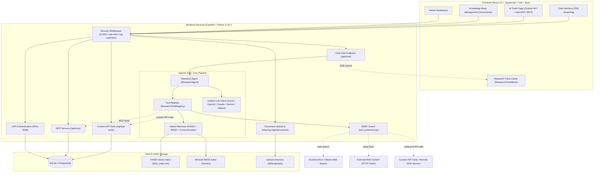

# AskMiao (AI ChatBot)

An enterprise-grade intelligent knowledge-base conversational system powered by Contextual Hybrid RAG (Retrieval-Augmented Generation) and Agentic Autonomous Research architectures.

[繁體中文](README.md) | [English](README_en.md)

[](https://fastapi.tiangolo.com/)
[](https://react.dev/)
[](https://www.python.org/)
[](https://vitejs.dev/)
[](https://bun.sh/)
[](https://www.sqlite.org/)
[](LICENSE)

[Quick Start](#quick-start) | [Core Features](#core-features) | [System Architecture](#system-architecture) | [Directory Structure](#directory-structure) | [Environment Variables](#environment-variables) | [Documentation](#documentation) | [Contributing](#contributing) | [License](#license)

---

## Quick Start

### Requirements

| Component | Minimum Version | Recommended Tool & Purpose |
|---|---|---|
| Python | 3.10 or higher | Backend FastAPI server, RAG vector indexing, and Agentic research engine |
| Bun | 1.0 or higher | Preferred package manager and build tool for frontend |
| SQLite | 3.x (Built-in) | Zero-dependency relational database for local launch (PostgreSQL also supported) |

### 1. Clone Repository

```bash
git clone https://github.com/Scorpio-meow/AskMiao.git
cd AskMiao
```

### 2. Backend Setup & Launch

```bash
cd backend

# Create and activate Python virtual environment
py -m venv .venv

# Windows PowerShell:
.\.venv\Scripts\Activate.ps1
# Linux/macOS:
source .venv/bin/activate

# Install backend dependencies
pip install -r requirements.txt

# Copy the environment template and adjust for your environment
# Note: DATABASE_URL in .env.example points to PostgreSQL.
#       For a zero-dependency launch, set DATABASE_URL=sqlite:///./chatbot.db
cp .env.example .env

# Initialize database schema and admin account
py init_db.py

# Start FastAPI development server (Port 8001)
py main.py
```

### 3. Frontend Setup & Launch (Bun Preferred)

```bash
cd ../frontend

# Install frontend dependencies using Bun
bun install

# Start Vite development server (Port 3000 unless PORT is set)
bun run dev
```

Once launched, navigate to `http://localhost:3000` in your browser to start using AskMiao.
If you keep `PORT=3001` from `frontend/.env.example` (the origin allowed by the backend `ALLOWED_ORIGINS` default), use `http://localhost:3001` instead.

---

## Core Features

1. **Agentic RAG & Multi-Turn Autonomous Research**:
   - Built-in ReAct research agent (`ResearchAgent`) supporting Native Tool Calling.
   - Comprehensive toolset including internal knowledge search (`search_knowledge_base`), real-time web search (`web_search` with Ollama & DuckDuckGo dual-engine fallback), and deep web fetch (`web_fetch`).
   - Collapsible research trace timeline (`ResearchTraceBlock`) and clickable reference badges (`SourceBadges`) in frontend UI.
   - Answers cite their evidence as `[n]`; the badges list only the chunks or pages the answer actually cites, and the agent reports plainly when the knowledge base has nothing relevant.
   - Every tool result is marked as untrusted data; `web_fetch` only reads URLs that appear verbatim in the user's message or in this question's tool results, with an optional domain allowlist and a switch that disables web tools once knowledge-base content has been read.

2. **Reasoning Effort Multi-Tier Selection**:
   - Navigation header selector with 5 reasoning depth levels: `None (none)`, `Low (low)`, `Medium (medium)`, `High (high)`, and `Extreme (xhigh)`.
   - Full support for Azure OpenAI v1 and OpenAI reasoning models (GPT-5 series, o-series).
   - Automatic compatibility enforcement with tool calls per Microsoft Foundry specifications.

3. **Modular Contextual Hybrid RAG Pipeline**:
   - Integrates dense vector search (FAISS) and sparse Chinese keyword search (Whoosh BM25); both tracks always run and are merged by rank with RRF (Reciprocal Rank Fusion).
   - Re-ranked by a Cross-Encoder (`bge-reranker-base`), with a relevance threshold applied to the reranker's probability to drop irrelevant chunks.
   - Quantitative retrieval evaluation (Hit Rate, MRR, negative rejection rate), including a comparison of several relevance thresholds over a single rerank pass.

4. **Multi-Provider LLM Integration**:
   - Unified abstraction layer supporting dynamic switching between Azure OpenAI v1, OpenAI Official, Anthropic Claude, Google Gemini, and local Ollama models with automatic multi-model list normalization.

5. **Enterprise Security & Two-Layer Data Redaction**:
   - Dual-token security with RSA-2048 signed Access Tokens and HttpOnly Secure Cookies.
   - Recursive object-level masking and regex redaction (`security_logging.py`) preventing credential leaks in logs.
   - Client-facing errors expose only a random error code (`error_response.py`); full exceptions and stack traces stay in server-side logs (CWE-209 / CWE-497).
   - Every outbound URL request (OpenAPI spec import, `web_fetch`, MCP HTTP transport) is resolved and validated by `ssrf_protection.py`, blocking private ranges, cloud metadata endpoints, and dangerous ports.

6. **External Tool Extensibility & MCP Ecosystem**:
   - Define custom HTTP API tools through a form, or paste an OpenAPI / Swagger spec (OAS 2.0 / 3.0 / 3.1) to bulk-import endpoints as AI-callable tools.
   - Supports Bearer, API Key (header / query), and Basic authentication, with a built-in connectivity test for each tool.
   - Built-in MCP (Model Context Protocol) client over `stdio` and HTTP transports, discovering server tools and injecting them into the agent toolset.
   - Enabled custom API tools and MCP tools are loaded dynamically whenever tool definitions are assembled — no backend restart required.
   - Tools are shared by every user's agent, so only admins can manage them; `stdio` subprocesses inherit only system variables such as `PATH`, never the backend's keys or database settings (see [ADR-0004](docs/adr/0004-tool-admin-permissions-and-subprocess-isolation_en.md)).

7. **Multimodal Chat & AI Document Summaries**:
   - Chat accepts image and file attachments: images are passed to vision models as `image_url` parts, while text files are extracted and merged into the prompt context.
   - Uploaded documents receive an AI-generated outline and summary, which can be regenerated or edited manually from the document management page.

---

## System Architecture



---

## Directory Structure

```text
AskMiao/
├── backend/                        # FastAPI backend
│   ├── app/
│   │   ├── api/                    # RESTful API routers
│   │   │   ├── auth.py             # Register, login, refresh, logout
│   │   │   ├── chat.py             # Chat SSE streaming, model & tool listings
│   │   │   ├── documents.py        # Uploads, summaries, index rebuild
│   │   │   ├── api_tools.py        # Custom API tool CRUD, OpenAPI parse & import
│   │   │   ├── mcp.py              # MCP server management, discovery, tool testing
│   │   │   ├── admin.py            # Admin statistics and vector store operations
│   │   │   └── tags.py             # Ollama-compatible model listing endpoints
│   │   ├── core/                   # Config, auth, log redaction, LLM client
│   │   │   ├── config.py           # Global environment configuration
│   │   │   ├── domain_profile.py   # Domain profile loading and validation
│   │   │   ├── jwt_auth.py         # RSA-2048 JWT signing and verification
│   │   │   ├── llm_client.py       # Unified multi-provider LLM layer
│   │   │   ├── security_logging.py # Two-layer sensitive data redaction
│   │   │   ├── error_response.py   # Client error codes mapped to server logs
│   │   │   └── ssrf_protection.py  # Outbound URL validation and SSRF blocking
│   │   ├── models/                 # SQLAlchemy ORM and Pydantic schemas
│   │   ├── rag/                    # Modular RAG and agentic research core
│   │   │   ├── agent.py            # ReAct research agent (incl. multimodal input)
│   │   │   ├── research_session.py # Per-question citations, URL provenance, untrusted-data wrapping
│   │   │   ├── tools.py            # Built-in tools plus custom / MCP tool registration
│   │   │   ├── pipeline.py         # RAG execution pipeline and context assembly
│   │   │   ├── contextual_rag.py   # HybridContextualRAG facade
│   │   │   ├── evaluator.py        # Retrieval evaluation and relevance-threshold comparison
│   │   │   ├── indices/            # FAISS and BM25 index management
│   │   │   └── retrievers/         # Hybrid retrieval and Cross-Encoder reranking
│   │   ├── services/               # Business logic services
│   │   │   ├── chat_service.py     # Conversation and message persistence
│   │   │   ├── document_processor.py # Document parsing and AI summaries
│   │   │   ├── openapi_parser.py   # OpenAPI / Swagger spec parser
│   │   │   └── mcp_service.py      # MCP stdio / HTTP clients and tool conversion
│   │   └── tasks/                  # Background jobs (index rebuild, upload watcher)
│   ├── tests/                      # Backend tests (research, tools, MCP, SSRF)
│   ├── config/                     # Domain profile (domain_profile.json)
│   ├── main.py                     # FastAPI application entry point
│   ├── init_db.py                  # Database bootstrap and default admin creation
│   └── requirements.txt            # Python dependencies
├── frontend/                       # React 19 + Vite frontend
│   ├── src/
│   │   ├── pages/                  # Page components
│   │   │   ├── Chat/               # Chat module (MessageItem, TraceBlock, SourceBadges, Header)
│   │   │   ├── AiTools.jsx         # AI tools management (custom API, OpenAPI import, MCP)
│   │   │   ├── Documents.jsx       # Knowledge base upload and management
│   │   │   ├── AdminDashboard.jsx  # Admin dashboard
│   │   │   ├── LoginPage.jsx / RegisterPage.jsx # Authentication pages
│   │   │   └── ProfilePage.jsx     # User profile page
│   │   ├── hooks/                  # Custom hooks (useChat, useAuth, useDocuments)
│   │   ├── services/               # Axios wrappers and token interceptors
│   │   └── components/             # Shared UI components and layout
│   ├── package.json                # Frontend manifest (managed with Bun)
│   └── vite.config.js              # Vite build configuration
├── docs/                           # System specification and architecture docs
│   ├── api.md                      # API reference (Traditional Chinese)
│   ├── api_en.md                   # API reference (English)
│   ├── architecture.md             # Architecture & design (Traditional Chinese)
│   ├── architecture_en.md          # Architecture & design (English)
│   └── adr/                        # Architecture Decision Records
├── llms.txt                        # AI-friendly structure index (Traditional Chinese)
├── llms_en.txt                     # AI-friendly structure index (English)
├── CHANGELOG.md                    # Release notes (Traditional Chinese)
├── CHANGELOG_en.md                 # Release notes (English)
└── LICENSE                         # MIT license
```

---

## Environment Variables

### Backend Configuration (`backend/.env`)

| Variable | Description | Example / Default | Required |
|---|---|---|---|
| `DATABASE_URL` | Database connection string (no built-in default) | `sqlite:///./chatbot.db`, `postgresql+psycopg2://...` | Yes |
| `JWT_SECRET_KEY` | JWT signing key | `cb_jwt_sec_...` | Yes |
| `ADMIN_API_KEY` | Administrative API key | `cb_admin_key_...` | Yes |
| `LLM_API_BASE` | Local Ollama service endpoint | `http://localhost:11434` | No |
| `OLLAMA_TEMPERATURE` / `OLLAMA_NUM_PREDICT` | Ollama generation options (model defaults when unset) | `0.3` / `2048` | No |
| `MODEL_NAME` | Default model name (falls back to the first available model) | empty | No |
| `ENABLE_WEB_SEARCH` | Enable the agent's web tools (controls both `web_search` and `web_fetch`) | `true` | Yes |
| `AGENT_MAX_TURNS` | Maximum tool-calling turns per question (>= 1) | `5` | Yes |
| `CONVERSATION_HISTORY_MESSAGES` | Prior messages loaded from the database as context (0 disables) | `6` | Yes |
| `WEB_FETCH_ALLOWED_DOMAINS` | Domains `web_fetch` may read (subdomains included, comma-separated); only an explicit `*` means unrestricted | `*` | Yes |
| `BLOCK_WEB_TOOLS_AFTER_KB` | Refuse `web_search` and `web_fetch` once a knowledge-base tool has returned content in the same question | `true` | Yes |
| `AZURE_OPENAI_API_KEY` | Azure OpenAI API key | `your_azure_api_key` | No |
| `AZURE_OPENAI_ENDPOINT` | Azure OpenAI v1 endpoint URL | `https://your-resource.openai.azure.com` | No |
| `AZURE_OPENAI_DEPLOYMENT` | Azure deployment names (comma-separated for multiple models) | `gpt-4o,gpt-4o-mini` | No |
| `OPENAI_API_KEY` | OpenAI API key | `sk-...` | No |
| `OPENAI_VISION_MODEL` | OpenAI model used for image understanding | `gpt-4o` | No |
| `ANTHROPIC_API_KEY` | Anthropic Claude API key | `sk-ant-...` | No |
| `ANTHROPIC_MAX_TOKENS` | Output token cap per Claude response (required when using Claude models) | `16000` | No |
| `GEMINI_API_KEY` | Google Gemini API key | `AIza...` | No |
| `GEMINI_VISION_MODEL` | Gemini model used for image understanding | `gemini-2.5-flash` | No |
| `AVAILABLE_MODELS` | Explicit model list exposed to the frontend (comma-separated) | empty | No |
| `EMBEDDING_MODEL` | Embedding model name | `BAAI/bge-small-zh-v1.5` | No |
| `RERANKER_MODEL` | Cross-Encoder reranking model (required component: the backend refuses to start if it cannot load) | `BAAI/bge-reranker-base` | No |
| `HF_HOME` | Hugging Face model cache directory (`~/.cache/huggingface` when unset) | `./data/hf_home` | No |
| `HF_HUB_OFFLINE` | Load cached models offline without update checks at startup | `true` | No |
| `CHUNK_SIZE` / `CHUNK_OVERLAP` | Document chunk size and overlap | `300` / `100` | No |
| `RRF_K` | RRF fusion constant: score = Σ 1 / (`RRF_K` + rank) | `60` | Yes |
| `RERANK_TOP_K` | Fused candidates sent to the reranker (rerank time grows with this and with chunk length) | `20` | No |
| `RERANK_RELEVANCE_THRESHOLD` | Chunks whose reranker probability is below this are dropped; exact URL, post ID, and date matches are exempt | `0.2` | Yes |
| `FINAL_K` | Number of chunks passed to the LLM | `8` | No |
| `DOMAIN_PROFILE_PATH` | Domain profile (domain words, record date fields, summary fallback rules) | `config/domain_profile.json` | Yes |
| `JIEBA_DICTIONARY` | Replacement jieba main dictionary (e.g. the Traditional-Chinese-friendly `dict.txt.big`); changing it rebuilds BM25 automatically | empty | No |
| `MAX_FILE_SIZE_MB` | Per-file upload size limit | `10` | No |
| `ACCESS_TOKEN_EXPIRE_MINUTES` | Access token lifetime in minutes | `30` | No |
| `REFRESH_TOKEN_EXPIRE_DAYS` | Refresh token lifetime in days | `7` | No |
| `ALLOWED_ORIGINS` | Allowed CORS origins (comma-separated) | `http://localhost:3001` | No |
| `RATE_LIMIT_ENABLED` / `RATE_LIMIT_PER_MINUTE` | Rate limiting switch and per-minute cap | `true` / `60` | No |

> For the complete list see [`backend/.env.example`](./backend/.env.example) and [`backend/app/core/config.py`](./backend/app/core/config.py). Relative paths in path settings (`DATA_DIR`, `UPLOAD_DIR`, index paths, `HF_*`, `DOMAIN_PROFILE_PATH`, `JIEBA_DICTIONARY`) are always resolved against `backend/`. `HYBRID_ALPHA`, `NORMALIZATION`, and `FINAL_THRESHOLD` were removed and are ignored if left in `.env`.

### Frontend Configuration (`frontend/.env`)

| Variable | Description | Default | Required |
|---|---|---|---|
| `VITE_API_BASE` | Backend API base path (falls back to `/api`) | `http://localhost:8001` | No |
| `VITE_API_URL` | Absolute backend endpoint (used when `VITE_API_BASE` is unset) | `http://localhost:8001` | No |
| `VITE_TAGS_URL` | External model listing source URL | empty | No |
| `VITE_MODEL_POLL_INTERVAL_MS` | Model list polling interval (ms) | `300000` | No |
| `PORT` | Vite dev server port | `3001` | No |

---

## Documentation

- [API Reference](./docs/api_en.md) — RESTful endpoints, request/response JSON schemas, and WebSocket specs
- [Architecture & Design](./docs/architecture_en.md) — System modules, Agentic RAG pipeline, and security design
- [Architecture Decision Records (ADR)](./docs/adr/README_en.md) — Architectural decisions and trade-offs
- [AI System Guide](./llms_en.txt) — Machine-readable guide for AI Agents and LLMs
- [Changelog](./CHANGELOG_en.md) — Version release history

---

## Contributing

Contributions are welcome! Please follow these steps:

1. Fork the repository and create your feature branch (`git checkout -b feature/amazing-feature`).
2. Ensure code passes type checks and tests:
   - Backend tests: `pytest tests/`
   - Frontend validation: `bun x tsc --noEmit`, `bun run build`, `bun run lint`
3. Commit your changes (`git commit -m 'feat: Add amazing feature'`).
4. Push to your branch (`git push origin feature/amazing-feature`).
5. Open a Pull Request with a clear description of your changes.

---

## License

This project is licensed under the MIT License. See [LICENSE](LICENSE) for details.