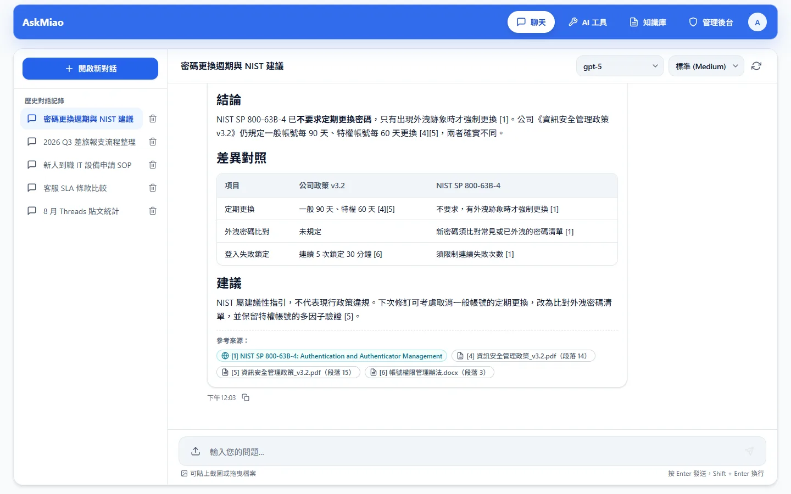
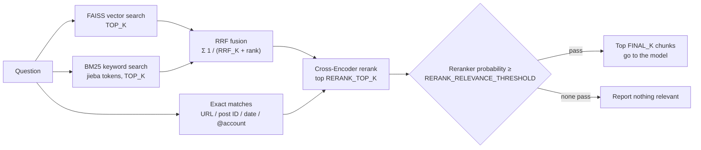
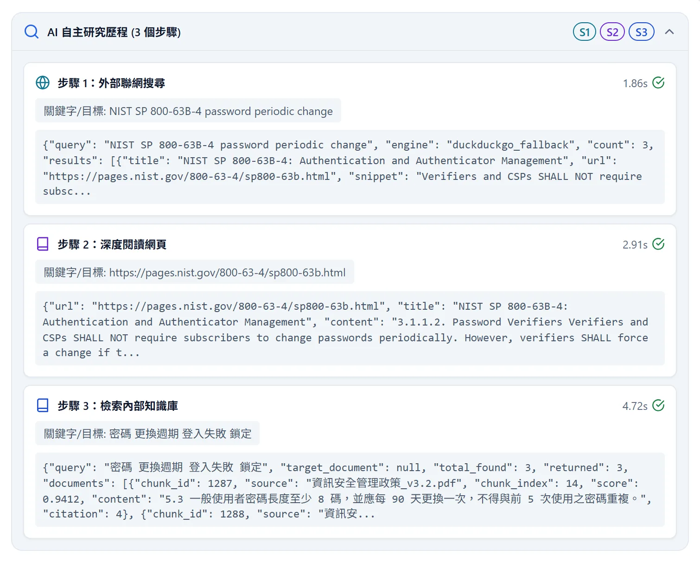
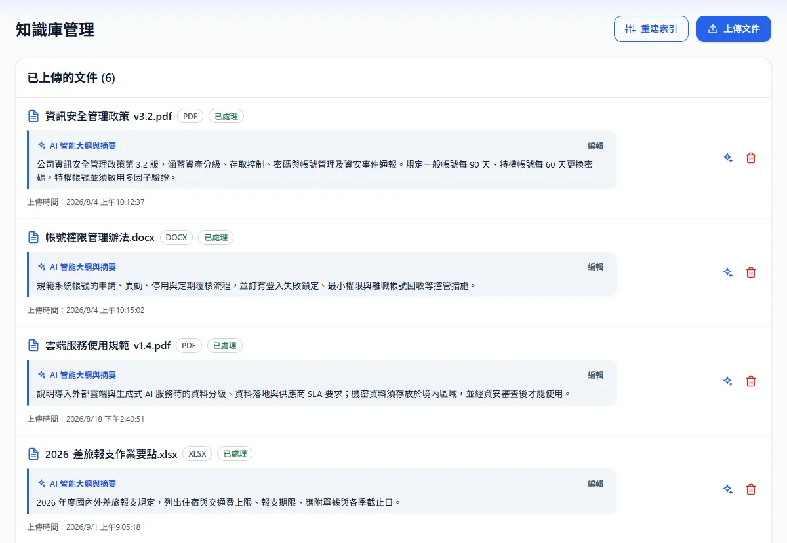
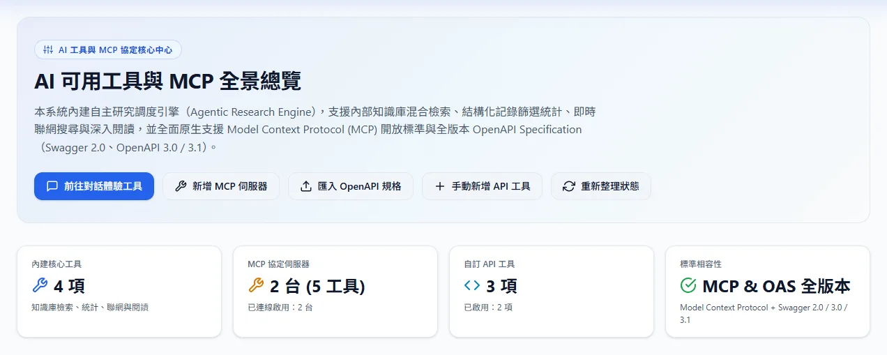
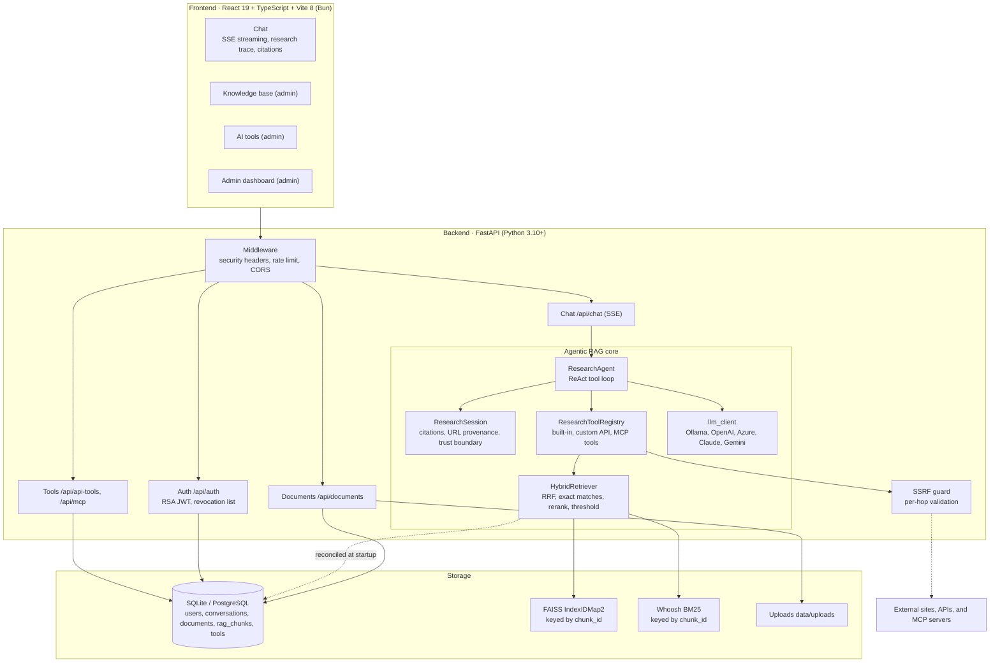
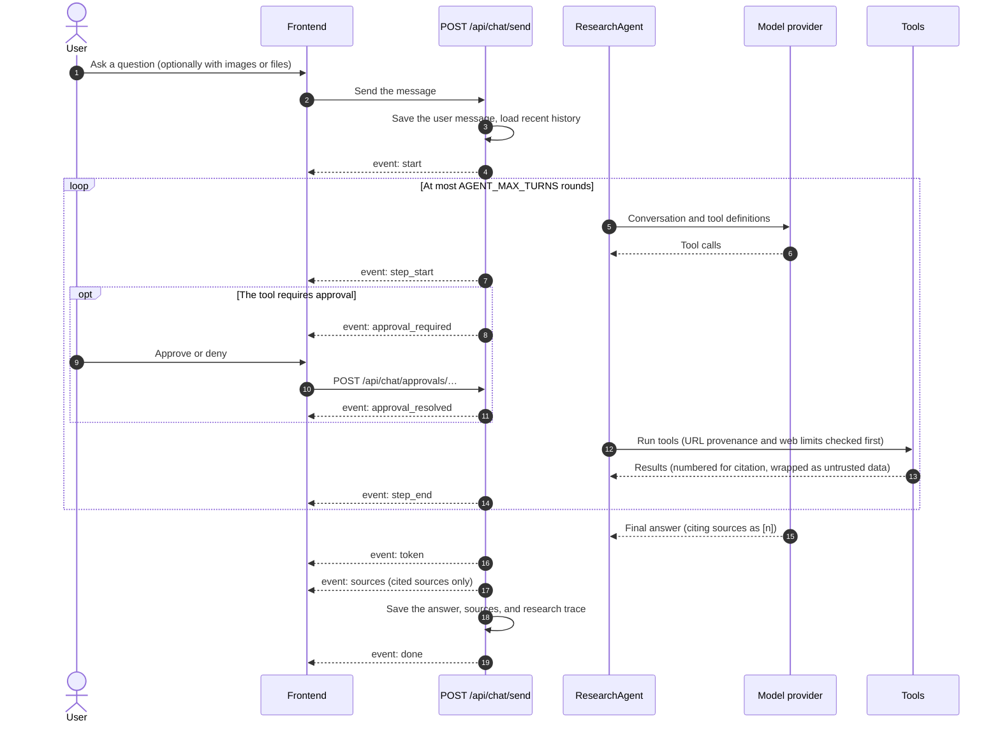

<div align="center">


# AskMiao

**An enterprise knowledge-base chat system that checks its own sources and cites them**

AskMiao answers with hybrid retrieval (FAISS + BM25 + Cross-Encoder) and agentic RAG research,<br>so every claim in an answer traces back to a document passage or web page, and it says so when the knowledge base has nothing relevant.

[繁體中文](README.md) | [English](README_en.md)

[](CHANGELOG_en.md)
[](https://www.python.org/)
[](https://fastapi.tiangolo.com/)
[](https://react.dev/)
[](https://www.typescriptlang.org/)
[](https://vite.dev/)
[](https://bun.sh/)
[](LICENSE)

[Website](https://scorpio-meow.github.io/AskMiao/) · [Quick Start](#quick-start) · [Documentation](#documentation) · [Changelog](CHANGELOG_en.md) · [Upgrade Guide](docs/upgrading_en.md)

</div>

<br>

<picture>
  <source media="(prefers-color-scheme: dark)" srcset="site/assets/screens/hero-chat-dark.webp">
  
</picture>

> [!IMPORTANT]
> **5.0.0 contains breaking changes that need manual steps**: `.env` has 10 new required settings (including `TOOL_SECRETS_KEY`, which each deployment generates itself), the compose PostgreSQL is accessed as a non-superuser, the backend packages must be reinstalled from the new `requirements.txt` (pinned versions with hashes), and every session must sign in again after a password change. Read the [upgrade guide](docs/upgrading_en.md#upgrading-from-400-to-500) before upgrading; the [5.0.0 changelog](CHANGELOG_en.md#500---2026-10-10) lists every change.
>
> **4.0.0 contains breaking changes**: `JWT_SECRET_KEY` and `JWT_ALGORITHM` are removed, RSA keys are mandatory, compose needs `POSTGRES_PASSWORD`, the dev server only accepts local connections, and tool calls with side effects need user approval. Read the [upgrade guide](docs/upgrading_en.md#upgrading-from-300-to-400) before upgrading from 3.x.

## Contents

- [Highlights](#highlights)
- [What's new in 5.0.0](#whats-new-in-500)
- [What's new in 4.0.0](#whats-new-in-400)
- [Features](#features)
- [Screenshots](#screenshots)
- [Architecture](#architecture)
- [Quick Start](#quick-start)
- [Configuration](#configuration)
- [Project Structure](#project-structure)
- [Development and Testing](#development-and-testing)
- [Troubleshooting](#troubleshooting)
- [Documentation](#documentation)
- [Versioning](#versioning)
- [Contributing](#contributing)
- [License](#license)

---

## Highlights

| | Capability | What it means |
|---|---|---|
| 1 | **Traceable answers** | Answers cite evidence as `[n]`, and the source badges list only the passages or pages actually cited, one click away from the original text |
| 2 | **Honest "nothing found"** | Chunks below the reranker probability threshold are dropped, and when nothing passes the agent says so instead of improvising |
| 3 | **Autonomous research** | A ReAct agent decides whether to search the knowledge base, count records precisely, search the web, or read a page, with the research trace shown live |
| 4 | **Hybrid retrieval** | Vector search and BM25 always both run, fused by rank with RRF and reranked by a Cross-Encoder; chunks are keyed by a database chunk_id |
| 5 | **Five LLM providers** | Ollama, OpenAI, Azure OpenAI, Anthropic Claude, and Google Gemini all support tool calling and streaming |
| 6 | **External tools and MCP** | Paste an OpenAPI spec to import API tools or connect MCP servers; managed by admins only, and calls with side effects need the user's approval first |
| 7 | **Defense in depth** | RSA JWT, Argon2 password hashing with login failure throttling, per-hop SSRF validation with the connection pinned to the checked IP, tool credentials encrypted at rest, a trust boundary for tool output, resource limits, and error codes instead of stack traces |

## What's new in 5.0.0

5.0.0 addresses the findings of a second security audit: day to day, logins pause after too many failures and a password change signs every session out; for deployment, `.env` has 10 new required settings, PostgreSQL is accessed as a non-superuser, and dependencies are pinned by hash.

| Area | Change | What to do when upgrading |
|---|---|---|
| Sign-in | Once a login identifier or source address reaches its failure threshold, logins pause with `429` and `Retry-After`; even the right password is not accepted during a lockout | Set the four `LOGIN_*` thresholds |
| Password changes | Every token issued earlier is rejected, so every session, including the current one, must sign in again with the new password | Nothing; `users.tokens_valid_after` is added and backfilled at startup |
| Accounts | New required `ALLOW_REGISTRATION`: when it is `false`, registration returns `403` and accounts (including the first admin) are created with `scripts/create_user.py` | Decide whether to allow self-registration |
| Tools | Tool credentials are encrypted with `TOOL_SECRETS_KEY` (Fernet) and the admin API shows `••••••••` in place of secret values; custom API tools accept only parameters declared in `parameters_schema` | Generate `TOOL_SECRETS_KEY` and keep it with your database backups; review each tool's parameter declarations |
| Dependencies | `requirements.txt` pins versions with hashes, and PyJWT replaces python-jose; `bun.lock` is committed with `frozenLockfile = true` | Reinstall the backend packages from the new `requirements.txt` (a fresh virtualenv is recommended); add backend packages through `requirements.in` |
| Frontend build | `bun run build` writes a CSP `<meta>` tag into `index.html`, so injected HTML cannot run scripts even when the web server sets no CSP | Rebuild; set `VITE_API_BASE` at build time when the API is on another origin |
| Deployment | `.env` has 10 new required settings, and `HOST`, `RELOAD`, and `COOKIE_SECURE` no longer have defaults; the interactive API docs are served only with `ENABLE_API_DOCS=true`; the compose PostgreSQL is accessed as the non-superuser `POSTGRES_APP_USER` | Add the required settings; set `POSTGRES_APP_USER` and `POSTGRES_APP_PASSWORD` and point `DATABASE_URL` at that account; for an existing data volume, run `20-app-role.sh` once after recreating the container |
| API | `GET /api/external-tags` and the WebSocket `/api/chat/ws/{user_id}` are removed; `POST /api/api-tools/parse-spec` no longer returns `raw_spec`; the admin user API no longer returns `hashed_password` | Adjust clients per the [API reference](docs/api_en.md) |

See the [5.0.0 changelog](CHANGELOG_en.md#500---2026-10-10) for everything that changed and the [upgrade guide](docs/upgrading_en.md#upgrading-from-400-to-500) for the steps.

## What's new in 4.0.0

4.0.0 is a security-audit release that addresses 52 findings. The change you will notice day to day is that tools with side effects now need approval; the change that affects deployment is that RSA keys and `POSTGRES_PASSWORD` are now required.

| Area | Change | What to do when upgrading |
|---|---|---|
| Tool calls | The agent pauses before calling a custom API or MCP tool with side effects until the asking user approves it in the chat; no answer within 300 seconds counts as a denial | Review each tool's "requires approval" setting on the AI tools page |
| Authentication | Tokens are resolved to the database account on every request, so disabling, deleting, or demoting an account takes effect immediately; refresh tokens are single-use; the HS256 fallback is gone | Remove `JWT_SECRET_KEY` and `JWT_ALGORITHM` from `.env`, and make sure `backend/keys/` is readable and writable |
| Outbound requests | After validation, connections are pinned to the approved IP, which stops DNS rebinding; `web_fetch` matches URL provenance on the full normalized URL | Nothing |
| Resource usage | Request bodies, messages, attachments, tool results, concurrent streams, and attachment storage are capped | Clients must handle `413`, `422`, and `429` |
| Deployment | The compose PostgreSQL needs `POSTGRES_PASSWORD` and binds to localhost only; the Vite dev server listens on `localhost` only; `X-Forwarded-For` is ignored by default | Set `POSTGRES_PASSWORD`; set `FORWARDED_ALLOW_IPS` behind a reverse proxy |
| API | `context_used` on messages is always `null`; `GET /api/chat/tools` requires login; `model_name` must be in the available model list | Adjust clients per the [API reference](docs/api_en.md) |

See the [4.0.0 changelog](CHANGELOG_en.md#400---2026-09-27) for everything that changed and the [upgrade guide](docs/upgrading_en.md#upgrading-from-300-to-400) for the steps.

## Features

### Agentic RAG research

- **ReAct research loop**: `ResearchAgent` gathers evidence over several rounds with native tool calling, capped by `AGENT_MAX_TURNS`; when the model stops calling tools, that response is the final answer.
- **Four built-in tools**:

  | Tool | Purpose |
  |---|---|
  | `search_knowledge_base` | Search knowledge-base chunks, optionally restricted to one document with `target_document` |
  | `filter_and_count_records` | Count structured records precisely by date, author, or keyword (for example all posts in a month) |
  | `web_search` | Web search via Ollama Web Search when `OLLAMA_API_KEY` is set, otherwise DuckDuckGo |
  | `web_fetch` | Read a full web page, limited to URLs that appear verbatim in the user's message or in this question's tool results |

- **Research trace**: each step's tool, arguments, result preview, and duration stream over SSE and appear as a collapsible timeline.
- **Multimodal questions**: attach images and files (up to 5 per message, 15 MiB each, 20 MiB in total); images go to vision models as `image_url` parts, and text attachments are extracted into the question.
- **Conversation history**: each question loads the latest `CONVERSATION_HISTORY_MESSAGES` messages from the database, so restarts keep the context.

### Traceable answers

- Each question builds a citation table keyed by chunk_id for knowledge-base chunks and by URL for web pages; numbers are assigned on first appearance and the model cites them as `[n]`.
- Source badges list only the entries the answer cites, in order of first citation, such as "[2] 員工手冊.pdf（段落 3）"; no citations means no badges.
- Every tool result is wrapped in an `<untrusted_tool_result>` marker whose id changes per question, so the model treats it as data and ignores instructions hidden in documents or web pages.

### Hybrid retrieval engine


```mermaid
flowchart LR
    Q["Question"] --> V["FAISS vector search<br/>TOP_K"]
    Q --> B["BM25 keyword search<br/>jieba tokens, TOP_K"]
    Q --> E["Exact matches<br/>URL / post ID / date / @account"]
    V --> F["RRF fusion<br/>Σ 1 / (RRF_K + rank)"]
    B --> F
    F --> R["Cross-Encoder rerank<br/>top RERANK_TOP_K"]
    E --> R
    R --> T{"Reranker probability ≥<br/>RERANK_RELEVANCE_THRESHOLD"}
    T -->|pass| K["Top FINAL_K chunks<br/>go to the model"]
    T -->|none pass| N["Report nothing relevant"]
```

- **Both tracks always run**: chunks found by only one track still reach the reranker, so proper nouns and codes are no longer drowned out.
- **The threshold reads the reranker probability**: exact URL, post ID, and date matches are exempt and ranked first.
- **The database is the source of truth**: chunks live in the `rag_chunks` table, and FAISS (`IndexIDMap2`) and BM25 are keyed by chunk_id; startup reconciles both indexes automatically, and deleting a document removes only its vectors.
- **Measurable**: `scripts/evaluate_retrieval.py` computes hit@k, recall@k, MRR, and the negative rejection rate from a golden set and compares several thresholds at once.

### Multi-provider LLM

- One calling layer supports **Ollama, OpenAI, Azure OpenAI v1, Anthropic Claude (official SDK), and Google Gemini**, routed by model name, all with tool calling and streaming.
- The frontend switches models and five reasoning levels: `None`, `Low`, `Medium`, `High`, and `X-High`; the level is passed to OpenAI and Azure OpenAI reasoning models.
- The model list comes from `AVAILABLE_MODELS` or is built from the configured keys; see the [configuration reference](docs/configuration_en.md#llm-providers-and-models).

### Knowledge base and document processing

- 27 file extensions: `.txt`, `.md`, `.markdown`, `.pdf`, `.docx`, `.pptx`, `.xlsx`, `.csv`, `.json`, `.yaml`, `.yml`, `.xml`, `.html`, `.htm`, `.log`, `.py`, `.js`, `.ts`, `.tsx`, `.jsx`, `.java`, `.cpp`, `.c`, `.sql`, `.sh`, `.ini`, `.env`.
- **Robust PDF extraction**: PyMuPDF extracts text and repairs embedded fonts missing ToUnicode maps; blank or garbled pages go through vision-model OCR (Azure OpenAI, OpenAI, or Gemini), with pypdf as the last fallback.
- **Smart chunking**: Q&A documents become one chunk per question-answer pair, structured records and JSON become one chunk per record, and everything else is split recursively on Chinese punctuation.
- **AI outlines and summaries**: uploads get an AI summary that can be regenerated or edited; rule-based summaries take over when the LLM fails. The summaries also form the knowledge-base catalog the agent uses to decide which document to search.

### External tools and MCP

- **Custom API tools**: create them with a form or bulk-import from an OpenAPI / Swagger spec (OAS 2.0, 3.0, 3.1), with Bearer, API key (header / query), and Basic auth, plus a live test. Calls accept only the parameters declared in `parameters_schema`, and query parameters fixed in the tool URL cannot be overridden.
- **MCP client**: `stdio` and HTTP transports, automatic tool discovery, and tools added to the agent as `mcp_<server>_<tool>`; presets for time and filesystem servers are built in (the filesystem preset exposes only the dedicated sandbox directory `backend/mcp_filesystem_sandbox`).
- **Loaded dynamically**: enabled tools are read from the database whenever tool definitions are assembled, so changes need no restart.
- **Approval before calls**: tools with side effects run only after the asking user approves them in the chat; see [tool call approval](#tool-call-approval) below.
- **Admins only**: tools are shared by every user's agent, so `/api/api-tools`, `/api/mcp`, and the AI tools page are admin-only; `stdio` subprocesses inherit only system variables such as `PATH`, never see the backend's keys, run in a fresh empty temporary directory, and are terminated together with their whole process tree on close ([ADR-0004](docs/adr/0004-tool-admin-permissions-and-subprocess-isolation_en.md)).
- **Credentials encrypted at rest**: custom API tools' headers and auth settings and MCP servers' environment variables and headers are encrypted with `TOOL_SECRETS_KEY` before they reach the database; the admin API returns only `••••••••`, and leaving the mask unchanged when editing keeps the stored value.

### Tool call approval

The agent can look things up on its own, but it will not submit a request, delete a record, or call a write API on your behalf by itself. When it calls a tool marked "requires approval":

1. The stream sends `approval_required` (with the `approval_id`, the tool's display name, the `target` where the request is actually sent, and its arguments) and the agent pauses.
2. A confirmation card appears in the answer, listing the tool, where the request goes, and every argument; control and format characters (such as bidirectional controls and zero-width characters) are marked as `⟦U+…⟧`.
3. The asking user clicks 核准執行 (approve) or 拒絕 (deny); the frontend calls `POST /api/chat/approvals/{approval_id}` and the stream then sends `approval_resolved`.
4. The tool runs only if approved. On a denial or no answer within 300 seconds, the model is told the user did not approve and is asked not to call the same tool again.

| Tool type | Default | Notes |
|---|---|---|
| Built-in tools (`search_knowledge_base` and 3 others) | Not required | Read-only; guarded by URL provenance and SSRF rules |
| Custom API tools using `GET`, `HEAD`, or `OPTIONS` | Not required | Admins can still tick "requires approval" per tool |
| Custom API tools using any other method | Required | Existing tools are backfilled from their HTTP method when upgrading to 4.0.0 |
| MCP servers | Required | Set per server; the card shows "server → tool" |

- A pending approval is bound to the asking user; any other account replying with the same `approval_id` gets `404`.
- Agent runs not started by a user in a chat have nobody to approve, so these tools never run there.
- See [ADR-0006](docs/adr/0006-tool-call-approval_en.md) for the rationale and trade-offs; the [website](https://scorpio-meow.github.io/AskMiao/#approval) has an interactive demo.

### Security

- **Authentication**: RSA-2048 signed JWT access tokens (the backend refuses to start without usable RSA keys), with the account's status and permissions read from the database on every request; the refresh token lives in an HttpOnly cookie and is single-use; logout revokes both; a password change invalidates every token the account was issued before; passwords are hashed with Argon2 (legacy bcrypt hashes are upgraded at login).
- **Sign-in and registration**: once one login identifier or one source address reaches its failure threshold within the time window, logins pause and return `429` with `Retry-After` (thresholds set by the `LOGIN_*` settings); with `ALLOW_REGISTRATION=false`, self-registration is closed and an admin creates accounts with `scripts/create_user.py`.
- **Outbound requests**: OpenAPI spec URLs, `web_fetch`, custom API tools, and the MCP HTTP transport go through `ssrf_protection.py`, which re-checks every redirect, pins the connection to the validated IP, and blocks private networks, cloud metadata endpoints, and dangerous ports; user-supplied URLs and admin-configured endpoints each use their own DNS thread pool.
- **Tool credentials and parameters**: tool credentials are encrypted at rest with `TOOL_SECRETS_KEY` (Fernet) and can no longer be read through the admin API; custom API tools accept only the parameters declared in `parameters_schema` and answer anything else with `400`.
- **Resource limits**: request bodies, message length, attachment count and size, chat attachment parsing, tool results, concurrent streams, and attachment storage are all capped; see [resource limits](docs/configuration_en.md#resource-limits).
- **Error codes**: unexpected exceptions reach clients only as a random error code, while full stack traces stay in the server log (CWE-209 / CWE-497).
- **Log redaction**: recursive object masking plus regex masking render passwords, tokens, and Authorization headers as `[REDACTED]`.
- **Dependencies**: the backend's `requirements.txt` pins every package version by hash, and the hashes are verified on install; the frontend commits `bun.lock` and sets `frozenLockfile = true`.
- **Deployment**: the compose PostgreSQL is accessed as a non-superuser; `HOST`, `RELOAD`, and `COOKIE_SECURE` must be set explicitly; the interactive API docs are served only with `ENABLE_API_DOCS=true`.
- **More**: security response headers, per-IP rate limiting (`X-Forwarded-For` is ignored unless a trusted reverse proxy is named in `FORWARDED_ALLOW_IPS`), a CORS allowlist, filename and path traversal checks, clickjacking protection in the frontend, and a CSP written into `index.html` at build time.

#### Threat coverage

| Threat | Protection | Where |
|---|---|---|
| Prompt injection hidden in documents or web pages | Tool results are wrapped in `<untrusted_tool_result>` tags with a per-question id; `web_fetch` can only read full URLs that appeared in the user's message or this question's tool results | `rag/research_session.py` |
| SSRF and DNS rebinding | Scheme, port, hostname, IP, and DNS results are validated on every hop, and connections are pinned to the approved IP | `core/ssrf_protection.py` |
| The agent changing external systems on its own | Tool calls with side effects need the asking user's approval | `rag/tool_approval.py` |
| Abuse of tool configuration | Only admins manage tools; `stdio` subprocesses never inherit backend secrets and run in an empty temporary directory | `api/api_tools.py`, `api/mcp.py`, `services/mcp_service.py` |
| The model slipping in parameters a tool does not offer | Custom API tools accept only the parameters declared in `parameters_schema`; query parameters fixed in the tool URL cannot be overridden | `api/api_tools.py` |
| Tool credentials leaking with a database or backup | Custom API tools' headers and auth settings and MCP servers' environment variables and headers are encrypted with `TOOL_SECRETS_KEY`, and the admin API returns only a mask | `core/tool_secrets.py` |
| Tokens outliving a disabled account | Account status and role are read by `sub` on every request, and refresh tokens are single-use | `core/jwt_auth.py`, `api/auth.py` |
| A stolen token renewing indefinitely | A password change updates `users.tokens_valid_after`, invalidating every access and refresh token issued before it | `core/jwt_auth.py`, `crud/crud_user.py` |
| Password guessing | Failures are counted per login identifier and per source address, and logins pause with `429` once a threshold is reached | `core/login_throttle.py` |
| Anyone registering and using the knowledge base and tools | With `ALLOW_REGISTRATION=false`, registration returns `403` and admins create the accounts | `api/auth.py`, `backend/scripts/create_user.py` |
| Resource exhaustion | Request bodies, attachments and attachment parsing, tool results, streams, and concurrent password hashes are capped | `core/limits.py`, `core/body_limit.py` |
| Leaking internals | Clients only get error codes; logs are redacted in two layers with field lengths capped | `core/error_response.py`, `core/security_logging.py` |
| SQL injection escalating to system commands | The compose PostgreSQL is accessed as a non-superuser, which cannot run commands with `COPY ... TO PROGRAM` or read server files | `backend/init-app-role.sh` |
| Injected HTML running scripts | The build writes a CSP into `index.html` that allows only the built scripts and the hashes of inline scripts | `frontend/vite.config.js` |
| Installing tampered or unreviewed package versions | The backend installs `requirements.txt` by hash, and the frontend installs from the frozen `bun.lock` | `backend/requirements.in`, `frontend/bun.lock` |

#### Key resource limits

| Item | Limit | When exceeded |
|---|---|---|
| General request body | 1 MiB (chat sends with a valid access token and document uploads whose token carries `is_admin` are allowed more) | `413` |
| One chat message | 20,000 characters | `422` |
| Attachments per message | 5, up to 15 MiB each and 20 MiB in total | `422` |
| Chat attachment parsing | 8 MiB of docx / pptx XML built into a DOM, 64 MiB uncompressed in total, 10,000 members | The attachment is not read, and the model is told so |
| Chat attachments parsed at once | 2 per backend process | Queued |
| Attachment storage per user | 200 MiB | `413` |
| Concurrent answer streams per user | 2 | `429` |
| One tool result passed to the model | 20,000 characters | Truncated |
| Pending tool approval | 300 seconds | Counts as a denial |
| Failed logins | `LOGIN_MAX_FAILURES_PER_ACCOUNT` per login identifier and `LOGIN_MAX_FAILURES_PER_ADDRESS` per source address (within `LOGIN_FAILURE_WINDOW_SECONDS` seconds) | `429`; logins pause for `LOGIN_LOCKOUT_SECONDS` seconds |

See [resource limits](docs/configuration_en.md#resource-limits) for the full list.

### Frontend experience

- Stop an answer mid-stream or retry a failed one; pressing Enter to pick a character in Zhuyin, Cangjie, and other input methods does not send the message.
- Light, dark, and follow-system appearance, applied before first paint with no white flash.
- Fully usable with a keyboard and screen readers, with WCAG AA contrast; phones get a single-row top bar and a chat page that fits one viewport.
- Deletions ask for confirmation, offline and back-online states are announced, and non-admins see a "no permission" page on admin routes.
- Markdown images in answers appear as links that open in a new tab only when clicked, so nothing is loaded from external hosts automatically; external links open in a new tab and name the actual host.

## Screenshots

<table>
  <tr>
    <td width="33%" valign="top">
      <picture>
        <source media="(prefers-color-scheme: dark)" srcset="site/assets/screens/feature-trace-dark.webp">
        
      </picture>
      <p align="center"><b>Research trace</b><br>Each step's tool, arguments, and result</p>
    </td>
    <td width="33%" valign="top">
      <picture>
        <source media="(prefers-color-scheme: dark)" srcset="site/assets/screens/feature-docs-dark.webp">
        
      </picture>
      <p align="center"><b>Knowledge base</b><br>Uploads, AI summaries, index rebuilds</p>
    </td>
    <td width="33%" valign="top">
      <picture>
        <source media="(prefers-color-scheme: dark)" srcset="site/assets/screens/feature-tools-dark.webp">
        
      </picture>
      <p align="center"><b>AI tools</b><br>OpenAPI import and MCP servers</p>
    </td>
  </tr>
</table>

> The screenshots come from the real frontend with demo data; the documents, conversations, and numbers shown are illustrative. The interface itself is in Traditional Chinese.

## Architecture


```mermaid
flowchart TB
    subgraph Client ["Frontend · React 19 + TypeScript + Vite 8 (Bun)"]
        ChatUI["Chat<br/>SSE streaming, research trace, citations"]
        DocsUI["Knowledge base (admin)"]
        ToolsUI["AI tools (admin)"]
        AdminUI["Admin dashboard (admin)"]
    end

    subgraph Backend ["Backend · FastAPI (Python 3.10+)"]
        MW["Middleware<br/>security headers, rate limit, CORS"]
        Auth["Auth /api/auth<br/>RSA JWT, revocation list"]
        ChatAPI["Chat /api/chat (SSE)"]
        DocAPI["Documents /api/documents"]
        ToolAPI["Tools /api/api-tools, /api/mcp"]

        subgraph Core ["Agentic RAG core"]
            Agent["ResearchAgent<br/>ReAct tool loop"]
            Session["ResearchSession<br/>citations, URL provenance, trust boundary"]
            Registry["ResearchToolRegistry<br/>built-in, custom API, MCP tools"]
            Retriever["HybridRetriever<br/>RRF, exact matches, rerank, threshold"]
            LLM["llm_client<br/>Ollama, OpenAI, Azure, Claude, Gemini"]
        end

        SSRF["SSRF guard<br/>per-hop validation"]
    end

    subgraph Storage ["Storage"]
        DB[("SQLite / PostgreSQL<br/>users, conversations, documents, rag_chunks, tools")]
        FAISS["FAISS IndexIDMap2<br/>keyed by chunk_id"]
        BM25["Whoosh BM25<br/>keyed by chunk_id"]
        Files["Uploads data/uploads"]
    end

    Client --> MW
    MW --> Auth & ChatAPI & DocAPI & ToolAPI
    ChatAPI --> Agent
    Agent --> Session
    Agent --> Registry
    Agent --> LLM
    Registry --> Retriever
    Registry --> SSRF
    SSRF -.-> Ext["External sites, APIs, and MCP servers"]
    Retriever --> FAISS & BM25
    DocAPI --> Files
    DocAPI --> DB
    Retriever -.->|reconciled at startup| DB
    Auth --> DB
    ToolAPI --> DB
```

The journey of one question:


```mermaid
sequenceDiagram
    autonumber
    actor U as User
    participant FE as Frontend
    participant API as POST /api/chat/send
    participant AG as ResearchAgent
    participant LLM as Model provider
    participant T as Tools

    U->>FE: Ask a question (optionally with images or files)
    FE->>API: Send the message
    API->>API: Save the user message, load recent history
    API-->>FE: event: start
    loop At most AGENT_MAX_TURNS rounds
        AG->>LLM: Conversation and tool definitions
        LLM-->>AG: Tool calls
        API-->>FE: event: step_start
        opt The tool requires approval
            API-->>FE: event: approval_required
            U->>FE: Approve or deny
            FE->>API: POST /api/chat/approvals/…
            API-->>FE: event: approval_resolved
        end
        AG->>T: Run tools (URL provenance and web limits checked first)
        T-->>AG: Results (numbered for citation, wrapped as untrusted data)
        API-->>FE: event: step_end
    end
    LLM-->>AG: Final answer (citing sources as [n])
    API-->>FE: event: token
    API-->>FE: event: sources (cited sources only)
    API->>API: Save the answer, sources, and research trace
    API-->>FE: event: done
```

See [Architecture & Design](docs/architecture_en.md) for module-level details.

## Quick Start

### Requirements

| Item | Requirement | Notes |
|---|---|---|
| Python | 3.10 or later | Backend |
| Bun | 1.x | Frontend package manager, dev server, and build |
| Database | SQLite (bundled with Python) or PostgreSQL | SQLite works with zero dependencies |
| Models | About 1.2 GB downloaded on first start | Embedding model `BAAI/bge-small-zh-v1.5` and reranker `BAAI/bge-reranker-base` |
| LLM | Any one | A local Ollama, or an OpenAI, Azure OpenAI, Anthropic, or Gemini API key |

### 1. Get the source

```bash
git clone https://github.com/Scorpio-meow/AskMiao.git
cd AskMiao
```

### 2. Configure and start the backend

```bash
cd backend

# create and activate a virtual environment (on Windows you can use py -m venv .venv)
python -m venv .venv
# Windows PowerShell
.\.venv\Scripts\Activate.ps1
# Linux / macOS
source .venv/bin/activate

# requirements.txt pins every package version with hashes, verified on install
pip install -r requirements.txt
cp .env.example .env
```

Edit `backend/.env` before starting:

1. **Database**: the template's `DATABASE_URL` points to PostgreSQL; for a zero-dependency start use `DATABASE_URL=sqlite:///./chatbot.db`.
2. **Keys**: replace `ADMIN_API_KEY` with a random string, for example from `python -c "import secrets; print(secrets.token_urlsafe(32))"`. Replace `TOOL_SECRETS_KEY` with a Fernet key generated for this deployment (the template value is not a valid key, and the backend refuses to start until it is replaced):

   ```bash
   python -c "from cryptography.fernet import Fernet; print(Fernet.generate_key().decode())"
   ```

   JWTs are always signed with the RSA keys in `backend/keys/`, so no separate signing secret is needed.
3. **Models**: for a local Ollama keep `LLM_API_BASE=http://localhost:11434`; for cloud models fill in the matching API key, and add `ANTHROPIC_MAX_TOKENS` for Claude.

The template provides the other required settings, and their template values suit local development: `HOST=127.0.0.1` accepts local connections only, `RELOAD=false`, `COOKIE_SECURE=false` (must be `true` when serving over HTTPS), `ENABLE_API_DOCS=false`, `ALLOW_REGISTRATION=false` (see step 4 for the first admin), and the four login failure throttling thresholds; see [Configuration](#configuration) for each. Then run the backend:

```bash
python main.py
```

The first start creates the database tables, generates the RSA keys for JWT (`backend/keys/`, which the backend account must be able to write; the backend refuses to start if the keys cannot be loaded), and downloads the embedding and reranker models. When it is up:

- API: `http://localhost:8001`
- Interactive API docs (Swagger UI): `http://localhost:8001/docs`, served only with `ENABLE_API_DOCS=true` (the template has `false`; keep it off for public deployments)

> [!NOTE]
> `init_db.py` is a compatibility script that adds columns and indexes to older PostgreSQL databases; fresh installs do not need it, and SQLite does not support its `ADD COLUMN IF NOT EXISTS` statement.

### 3. Start the frontend

In another terminal:

```bash
cd frontend
bun install
bun run dev
```

`bun install` installs only what the committed `bun.lock` records (`frontend/bunfig.toml` sets `frozenLockfile = true`) and fails when `bun.lock` and `package.json` disagree.

Open `http://localhost:3000`. Without `frontend/.env`, the frontend calls the relative path `/api`, which the Vite dev server proxies to `http://127.0.0.1:8001`, so no CORS setup is needed. If you copied `frontend/.env.example` (`PORT=3001`, calling the backend directly), open `http://localhost:3001` instead.

> [!NOTE]
> The Vite dev and preview servers listen on `localhost` only, so other devices on the LAN cannot reach them. To serve other devices, build with `bun run build` and serve `frontend/build/` from a real web server that reverse-proxies `/api`.

### 4. Create the first admin

The knowledge base, AI tools, and admin dashboard pages are admin-only, and no admin account exists out of the box. The template's `ALLOW_REGISTRATION=false` keeps self-registration closed (the login page shows no sign-up link and `POST /api/auth/register` returns `403`), so an admin creates accounts with `scripts/create_user.py`:

1. In `backend/` (with the virtual environment active), run the command below and enter the password twice when prompted. User names are 3 to 50 characters of letters, digits, underscores, and hyphens; passwords need at least 8 characters with an uppercase letter, a lowercase letter, and a digit.

   ```bash
   python scripts/create_user.py --username admin --email admin@example.com --admin
   ```

2. Sign in to the frontend with that account to see the admin pages. Create other accounts with the same script (without `--admin` for a regular user), or promote existing users in the admin dashboard.

The password is entered interactively, so it never lands in the shell history or the process list. The script applies the same rules as registration and goes through the backend's own settings and database connection, so it works for both SQLite and PostgreSQL; run it from `backend/` so that a relative path such as `sqlite:///./chatbot.db` points to the database the backend uses.

With `ALLOW_REGISTRATION=true` you can instead create an account on the frontend's register page, then run the command below in `backend/` to make it an admin (replace `your_username` with the name you just registered) and sign out and back in:

```bash
python -c "from sqlalchemy import text; from app.models.database import engine; conn = engine.connect(); conn.execute(text('UPDATE users SET is_admin = :flag WHERE username = :name'), {'flag': True, 'name': 'your_username'}); conn.commit()"
```

### 5. Upload documents and ask

1. As an admin, open the knowledge base page and upload documents (up to 10 files per upload, each within `MAX_FILE_SIZE_MB`). AskMiao extracts the text, writes an AI summary, and indexes it.
2. Back in chat, pick a model and a reasoning level, then ask. Each `[n]` in the answer maps to a source badge below it.

### Using PostgreSQL (optional)

`backend/docker-compose.yml` provides PostgreSQL 17. When the data volume is first initialized, it runs `init.sql` (creates the tables) and then `init-app-role.sh` (creates the non-superuser account the backend connects with and hands it ownership of the tables). First set these three in `backend/.env` (compose refuses to start if any is missing), using two different random passwords, and point `DATABASE_URL` at the application account:

```dotenv
POSTGRES_PASSWORD=<password of the postgres superuser>
POSTGRES_APP_USER=askmiao_app
POSTGRES_APP_PASSWORD=<password of the application account>
DATABASE_URL=postgresql+psycopg2://askmiao_app:<password of the application account>@localhost:7690/chatbot
```

Then start the container:

```bash
cd backend
docker compose up -d
```

The container is published on the loopback address `127.0.0.1:7690` only, so neither the LAN nor the internet can reach it. `POSTGRES_PASSWORD` is only for compose and database administration, and the backend never reads it; the backend connects as a non-superuser, so even a SQL injection cannot run system commands or read server files. If a password contains characters such as `@`, `:`, or `/`, percent-encode them in `DATABASE_URL`.

A data volume initialized by an older compose file does not get the application account automatically: after setting the variables above and recreating the container with `docker compose up -d --wait` so that it is ready, run `docker compose exec postgres bash /docker-entrypoint-initdb.d/20-app-role.sh` once; see the [upgrade guide](docs/upgrading_en.md#upgrading-from-400-to-500).

## Configuration

Backend settings live in `backend/.env`. These 20 have no defaults, and the backend refuses to start if any is missing (the template provides recommended values; `TOOL_SECRETS_KEY` must be generated):

| Variable | Template | Description |
|---|---|---|
| `DATABASE_URL` | PostgreSQL example | Connection string; use `sqlite:///./chatbot.db` for SQLite |
| `ADMIN_API_KEY` | placeholder | Admin API key (unused by routes today, but required by settings validation) |
| `TOOL_SECRETS_KEY` | placeholder (not a valid key) | Fernet key that encrypts tool credentials, validated at startup; after changing it, stored tool credentials must be entered again |
| `ALLOW_REGISTRATION` | `false` | Whether self-registration is open; when closed, accounts are created with `scripts/create_user.py` |
| `LOGIN_MAX_FAILURES_PER_ACCOUNT` | `5` | Failures of one login identifier (case-insensitive) within the window that pause its logins (≥ 1) |
| `LOGIN_MAX_FAILURES_PER_ADDRESS` | `20` | Failures from one source address within the window that pause its logins (≥ 1); users behind a proxy share one address |
| `LOGIN_FAILURE_WINDOW_SECONDS` | `900` | Window in seconds for counting login failures (≥ 1) |
| `LOGIN_LOCKOUT_SECONDS` | `900` | Seconds logins stay paused (≥ 1), answered with `429` and `Retry-After` |
| `HOST` | `127.0.0.1` | Listen address of `python main.py`; change to `0.0.0.0` only when a container or a reverse proxy on another host must connect |
| `RELOAD` | `false` | Reload on code changes; set to `true` only for development |
| `COOKIE_SECURE` | `false` | Whether the refresh token cookie is sent over HTTPS only; must be `true` when serving over HTTPS |
| `ENABLE_API_DOCS` | `false` | Serve `/docs`, `/redoc`, and `/openapi.json`; keep `false` for public deployments |
| `ENABLE_WEB_SEARCH` | `true` | Offer `web_search` and `web_fetch` |
| `AGENT_MAX_TURNS` | `5` | Tool-calling turn limit per question (≥ 1) |
| `CONVERSATION_HISTORY_MESSAGES` | `6` | Prior messages loaded as context (0 disables) |
| `WEB_FETCH_ALLOWED_DOMAINS` | `*` | Domains `web_fetch` may read; only an explicit `*` means unrestricted |
| `BLOCK_WEB_TOOLS_AFTER_KB` | `true` | Disable web tools once knowledge-base content has been read |
| `RRF_K` | `60` | RRF fusion constant |
| `RERANK_RELEVANCE_THRESHOLD` | `0.2` | Reranker probability threshold (provisional; calibrate with a golden set) |
| `DOMAIN_PROFILE_PATH` | `config/domain_profile.json` | Domain profile (domain words, date fields, summary fallback rules) |

Common optional settings:

| Variable | Description |
|---|---|
| `LLM_API_BASE` | Ollama base URL (template `http://localhost:11434`) |
| `OPENAI_API_KEY`, `AZURE_OPENAI_*`, `ANTHROPIC_API_KEY`, `GEMINI_API_KEY` | Cloud model keys; their models join the list automatically |
| `ANTHROPIC_MAX_TOKENS` | Output cap per Claude response (required for Claude) |
| `MODEL_NAME`, `AVAILABLE_MODELS` | Default model and a custom model list |
| `CHUNK_SIZE`, `CHUNK_OVERLAP` | Chunk length and overlap (template 300 / 100) |
| `HF_HOME`, `HF_HUB_OFFLINE` | Model cache location and offline mode |
| `ALLOWED_ORIGINS` | CORS origins (needed when the frontend calls the backend directly) |
| `FORWARDED_ALLOW_IPS` | Address of a reverse proxy that overwrites `X-Forwarded-For`; when unset, rate limiting and per-address login throttling use the direct peer |

Every setting, with defaults, template values, provider routing rules, resource limits, and frontend variables, is in the **[configuration reference](docs/configuration_en.md)**.

## Project Structure

```text
AskMiao/
├── backend/                          # FastAPI backend
│   ├── main.py                       # Entry point (python main.py)
│   ├── app/
│   │   ├── __init__.py               # Backend version __version__
│   │   ├── api/                      # Routers: auth, chat, documents, api_tools, mcp, admin, tags
│   │   ├── core/                     # Settings, auth, security, and the LLM layer
│   │   │   ├── config.py             # Settings: every environment variable and its validation
│   │   │   ├── lifespan.py           # Startup: create tables, initialize RAG, watch uploads
│   │   │   ├── llm_client.py         # One calling layer for five providers (tool calls, streaming)
│   │   │   ├── jwt_auth.py           # RSA JWT, Argon2 password hashing, revocation checks
│   │   │   ├── login_throttle.py     # Login failure throttling (per login identifier and source address)
│   │   │   ├── tool_secrets.py       # Tool credential encryption and admin API masking
│   │   │   ├── limits.py             # Resource limit constants (request bodies, attachments, tool results, logs, ...)
│   │   │   ├── body_limit.py         # Request body size limit middleware
│   │   │   ├── ssrf_protection.py    # Outbound URL validation, per-hop SSRF checks, and IP pinning
│   │   │   ├── error_response.py     # Client-facing error codes
│   │   │   ├── security_logging.py   # Two-layer log redaction
│   │   │   └── domain_profile.py     # Domain profile loading and validation
│   │   ├── models/                   # SQLAlchemy tables and Pydantic request models
│   │   ├── rag/                      # Retrieval and agentic RAG core
│   │   │   ├── contextual_rag.py     # HybridContextualRAG: facade for reconciliation, writes, and search
│   │   │   ├── agent.py              # ResearchAgent: ReAct tool loop and streaming events
│   │   │   ├── research_session.py   # Per-question citations, URL provenance, untrusted-data wrapping
│   │   │   ├── tools.py              # Built-in tools plus custom API / MCP tool registration and execution
│   │   │   ├── tool_approval.py      # In-chat approval for tools with side effects
│   │   │   ├── pipeline.py           # Chunking and the agent streaming pipeline
│   │   │   ├── tokenizers.py         # jieba tokenizer and tokenizer signature
│   │   │   ├── evaluator.py          # Retrieval evaluation (hit@k, MRR, negative rejection)
│   │   │   ├── indices/              # chunk_store (rag_chunks), vector_store (FAISS), bm25_store
│   │   │   └── retrievers/hybrid.py  # RRF fusion, exact matches, reranking, relevance threshold
│   │   ├── services/                 # Chat, document processing (with PDF OCR), OpenAPI parsing, MCP client
│   │   └── tasks/uploads_watcher.py  # Missing-upload watcher (warnings only)
│   ├── config/domain_profile.json    # Domain profile
│   ├── eval/                         # Retrieval evaluation golden sets
│   ├── scripts/                      # Maintenance scripts (including create_user.py for accounts)
│   ├── tests/                        # pytest suite
│   ├── docker-compose.yml            # Optional PostgreSQL 17 (local 127.0.0.1:7690, needs POSTGRES_PASSWORD and POSTGRES_APP_*)
│   ├── init.sql                      # PostgreSQL schema bootstrap
│   ├── init-app-role.sh              # PostgreSQL account the backend connects with (non-superuser)
│   ├── init_db.py                    # Compatibility patch for older PostgreSQL databases
│   ├── requirements.in               # Direct dependencies; edit this file to add or upgrade packages
│   ├── requirements.txt              # Generated from requirements.in, with pinned versions and hashes
│   └── .env.example                  # Backend settings template
├── frontend/                         # React 19 + TypeScript + Vite 8
│   ├── src/
│   │   ├── pages/                    # Chat/, Documents, AiTools, AdminDashboard, login, register, profile
│   │   ├── components/               # Layout, route guards, and the ui/ component library
│   │   ├── hooks/                    # useChat (streaming, stop, retry), useAuth, useDocuments
│   │   ├── services/                 # api.ts (Axios and token refresh), sse.ts (SSE parser)
│   │   ├── contexts/ThemeContext.tsx # Light / dark / follow system
│   │   └── styles/                   # Design tokens and reset
│   ├── package.json                  # Frontend version and scripts
│   ├── bun.lock                      # Pinned frontend dependencies (never rewritten by bun install)
│   └── .env.example
├── site/                             # GitHub Pages intro site (static)
├── docs/
│   ├── api.md                        # API reference
│   ├── architecture.md               # Architecture and design
│   ├── configuration.md              # Configuration reference
│   ├── upgrading.md                  # Upgrade guide
│   └── adr/                          # Architecture decision records
├── .github/workflows/deploy-pages.yml # Deploys site/ to GitHub Pages when it changes
├── llms.txt                          # Project guide for AI agents
├── CHANGELOG.md                      # Release notes
└── LICENSE
```

Every document has an English counterpart ending in `_en`.

## Development and Testing

### Backend tests

```bash
cd backend
python -m pytest
```

- The tests load the settings, so the required settings must be available in `backend/.env` or the environment.
- Some tests load the real embedding and reranker models (the model cache is needed), so a full run takes a few minutes.
- On Windows accounts whose user name contains non-ASCII characters, pass an ASCII temp path such as `--basetemp=C:\pytest-tmp`; otherwise FAISS fails to write its temporary indexes.

### Frontend checks

```bash
cd frontend
bun run test --run   # Vitest unit tests (SSE parser)
bun run lint         # ESLint (JS / JSX)
bun x tsc --noEmit   # TypeScript type check
bun run build        # Build into build/
```

`bun run build` writes a CSP `<meta>` tag into `build/index.html`: scripts are limited to the built files and the hashes of the inline scripts in `index.html`, and `connect-src` adds the API origin from `VITE_API_BASE`/`VITE_API_URL`, so changing either setting requires a rebuild. The dev server does not apply this CSP.

### Dependencies

- **Backend**: `requirements.in` lists only direct dependencies; `requirements.txt` is generated from it and pins every package (transitive ones included) by version and hash, and `pip install -r requirements.txt` verifies each one. To add or upgrade a package, edit `requirements.in`, regenerate `requirements.txt` with uv in `backend/`, and commit both files:

  ```bash
  uv pip compile requirements.in --universal --python-version 3.10 --generate-hashes -o requirements.txt
  ```

- **Frontend**: `bun.lock` is committed and `frontend/bunfig.toml` sets `frozenLockfile = true`: `bun install` installs only what `bun.lock` records and fails when it disagrees with `package.json`, and `bun add` cannot rewrite `bun.lock` either. To add or upgrade a package, temporarily set `frozenLockfile` to `false` to update `bun.lock`, set it back to `true`, and commit `package.json` and `bun.lock` together.

### Maintenance scripts

Run them from `backend/` with `python scripts/<script>`:

| Script | Purpose |
|---|---|
| `create_user.py` | Create an account (including the first admin): `--username` and `--email` are required, `--admin` creates an admin, and the password is entered interactively; see [Create the first admin](#4-create-the-first-admin) |
| `evaluate_retrieval.py` | Evaluate retrieval quality with a golden set and compare relevance thresholds (read-only, safe to run alongside the backend); see [calibrating the relevance threshold](docs/configuration_en.md#calibrating-the-relevance-threshold) |
| `reprocess_existing_docs.py` | Offline rebuild: re-extract text, regenerate summaries, re-chunk, and re-index. Stop the backend first |
| `reset_faiss.py` | Delete the FAISS and BM25 index files in `backend/data`, then recompute them from `rag_chunks` (asks for confirmation first) |
| `test_llm_clients.py` | Check the model list and each provider's request format with mocked responses, without calling any API |
| `docx_to_txt.py` | Convert `.docx` files in the upload directory to `.txt` |
| `migrate_sqlite_to_postgres.py` | Known issue: imports the removed `app.models.custom_agent` and cannot run at the moment |

## Troubleshooting

<details>
<summary><b>The backend fails to start with <code>Field required</code></b></summary>

A required setting is missing from `.env`; the error names the fields. Add them as listed under [Configuration](#configuration). `ALLOW_REGISTRATION`, `TOOL_SECRETS_KEY`, `HOST`, `RELOAD`, `COOKIE_SECURE`, `ENABLE_API_DOCS`, and the four `LOGIN_*` settings were added in 5.0.0; when coming from an older release, follow the [upgrade guide](docs/upgrading_en.md).

</details>

<details>
<summary><b>The backend fails to start with <code>TOOL_SECRETS_KEY 必須是 Fernet 金鑰</code> (TOOL_SECRETS_KEY must be a Fernet key)</b></summary>

`TOOL_SECRETS_KEY` is still the template placeholder or is not a valid Fernet key. Generate one with `python -c "from cryptography.fernet import Fernet; print(Fernet.generate_key().decode())"` and put it in `backend/.env`. Keep this key safe: after switching to a new key, the stored credentials of custom API tools and MCP servers can no longer be decrypted and must be entered again on the AI tools page.

</details>

<details>
<summary><b>The backend fails to start with an error about the RSA keys or <code>backend/keys</code></b></summary>

JWTs are always signed with the RSA keys, and the backend refuses to start when it cannot load or generate them instead of falling back to a shared secret. Make sure `jwt_private.pem` and `jwt_public.pem` in `backend/keys/` are intact and readable; on the first start the backend account must be able to write to that directory.

</details>

<details>
<summary><b>The backend fails to start because the reranker cannot load</b></summary>

The reranker is required. The first start downloads it from Hugging Face, so check the network and make sure `HF_HUB_OFFLINE` is not `true`; if the models were downloaded before, point `HF_HOME` at that cache.

</details>

<details>
<summary><b><code>python init_db.py</code> fails with <code>near "EXISTS": syntax error</code></b></summary>

SQLite does not need `init_db.py`; the backend creates the tables at startup. The script only patches older PostgreSQL databases.

</details>

<details>
<summary><b>The knowledge base, AI tools, and admin pages are missing after signing in</b></summary>

Those pages are admin-only. Follow [Create the first admin](#4-create-the-first-admin) and sign in again.

</details>

<details>
<summary><b>Every question reports that the knowledge base has nothing relevant</b></summary>

Make sure documents were uploaded and that `total_vectors` in `GET /api/admin/vector-store/info` (admin only) is above 0. If the index is fine, the relevance threshold may be too high; calibrate it with a real golden set as described in [calibrating the relevance threshold](docs/configuration_en.md#calibrating-the-relevance-threshold).

</details>

<details>
<summary><b>The frontend shows network or CORS errors</b></summary>

- Without `frontend/.env`, the frontend reaches `http://127.0.0.1:8001` through the Vite proxy, so make sure the backend is running on that port.
- With an absolute `VITE_API_BASE`, the browser calls the backend directly, and the backend's `ALLOWED_ORIGINS` must include the frontend origin (for example `http://localhost:3001`).
- With a `bun run build` output, the CSP's `connect-src` allows only the `VITE_API_BASE`/`VITE_API_URL` origin from build time; rebuild after changing the API address.

</details>

<details>
<summary><b>Other devices on the LAN cannot reach the frontend started with <code>bun run dev</code></b></summary>

The Vite dev and preview servers listen on `localhost` only, on purpose (dev-server endpoints such as `/__open-in-editor` must not be exposed). Build with `bun run build` and serve `frontend/build/` from a real web server such as nginx that reverse-proxies `/api` to the backend.

</details>

<details>
<summary><b><code>bun install</code> fails with <code>lockfile had changes, but lockfile is frozen</code></b></summary>

`frontend/bunfig.toml` sets `frozenLockfile = true`, so the install fails whenever `package.json` and `bun.lock` disagree instead of rewriting the pinned versions. Make sure both files come from the same revision; to add or upgrade a package on purpose, update `bun.lock` as described under [Dependencies](#dependencies) and commit both.

</details>

<details>
<summary><b>Clicking the approval card shows 「無法送出決定，可能已逾時」 (could not send the decision, it may have timed out)</b></summary>

A pending approval lasts only 300 seconds; after that the agent treats it as a denial and carries on, and each approval can be answered only once. Replies from any account other than the asking user fail the same way. Ask again and approve within 5 minutes.

</details>

<details>
<summary><b>A read-only tool asks for approval every time</b></summary>

MCP servers require approval by default, and custom API tools follow their HTTP method. Once you are sure the tool does not change external systems, an admin can edit the tool or MCP server on the AI tools page and untick "requires approval".

</details>

<details>
<summary><b>Signing in returns <code>429</code> with 「登入失敗次數過多，請稍後再試」 (too many failed logins, try again later)</b></summary>

Once one login identifier (user name or email, case-insensitive) fails `LOGIN_MAX_FAILURES_PER_ACCOUNT` times, or one source address fails `LOGIN_MAX_FAILURES_PER_ADDRESS` times, within `LOGIN_FAILURE_WINDOW_SECONDS` seconds, logins for that identifier or address pause for `LOGIN_LOCKOUT_SECONDS` seconds, and even the right password is refused meanwhile; the `Retry-After` header gives the seconds left.

- The pause lifts on its own. The counts live only in the backend process's memory, so restarting the backend also clears them.
- Behind the Vite dev proxy or a reverse proxy, every user's failures add up on the same source address, and reaching `LOGIN_MAX_FAILURES_PER_ADDRESS` pauses logins for everyone. Keep the per-address threshold looser than the per-account one; if the reverse proxy in front overwrites `X-Forwarded-For`, set `FORWARDED_ALLOW_IPS` to count real client addresses instead.

</details>

<details>
<summary><b>The API returns <code>429 Too Many Requests</code></b></summary>

- Rate limiting counts requests per connecting IP, 60 per 60 seconds by default. Behind the Vite dev proxy or a reverse proxy every user shares one IP, so raise `RATE_LIMIT_PER_MINUTE` if needed; if the reverse proxy in front overwrites `X-Forwarded-For`, set its address as `FORWARDED_ALLOW_IPS` to count real client IPs instead.
- A 429 from `POST /api/chat/send` means the same user already has 2 answers streaming; wait for one to finish.

</details>

## Documentation

| Document | Contents |
|---|---|
| [API Reference](docs/api_en.md) | Every endpoint's permission, request and response format, the SSE event contract, and error codes |
| [Architecture & Design](docs/architecture_en.md) | Layers, data model, retrieval pipeline, agent loop, authentication, and security design |
| [Configuration Reference](docs/configuration_en.md) | Defaults and effects of every environment variable, provider routing, threshold calibration, frontend settings |
| [Upgrade Guide](docs/upgrading_en.md) | Steps from 2.x to 3.0.0, from 3.0.0 to 4.0.0, and from 4.0.0 to 5.0.0, rollback, and troubleshooting |
| [Architecture Decision Records](docs/adr/README_en.md) | Context, trade-offs, and amendments of major design decisions |
| [llms_en.txt](llms_en.txt) | File map, system constraints, and verification steps for AI agents |
| [Changelog](CHANGELOG_en.md) | What was added, changed, removed, and fixed in each release |
| [Website](https://scorpio-meow.github.io/AskMiao/) | Interactive demos of citations, the retrieval threshold, tool call approval, and outbound protection |

## Versioning

- **Current version**: 5.0.0 (2026-10-10); see the [changelog](CHANGELOG_en.md).
- **Policy**: [Semantic Versioning](https://semver.org/). Incompatible changes, such as new required settings or changes to API permissions or the index format, bump the major version.
- **Where the version lives**: `__version__` in `backend/app/__init__.py` (used by the OpenAPI document and the MCP handshake) and `frontend/package.json`, updated together with `CHANGELOG.md` for each release.

## Contributing

Issues and pull requests are welcome:

1. Fork the repository and create a feature branch.
2. Write commit messages following [Conventional Commits](https://www.conventionalcommits.org/en/v1.0.0/) (for example `feat(rag): …` or `fix: …`; mark breaking changes with `!` and a `BREAKING CHANGE` footer).
3. Make sure the backend `python -m pytest` and the frontend `bun run test --run`, `bun run lint`, and `bun x tsc --noEmit` all pass.
4. Documentation is bilingual: whenever you change a document, update its `_en` counterpart and record the change under `[Unreleased]` in `CHANGELOG.md`.
5. The intro site's interactive demos reproduce backend rules in the browser. When you change the rules in these files, update `site/index.html` and `site/main.js` as well:
   - `rag/research_session.py`: citation numbering and URL provenance
   - `rag/retrievers/hybrid.py`: RRF fusion, mixed score, relevance threshold
   - `rag/tools.py`, `core/config.py`: `WEB_FETCH_ALLOWED_DOMAINS`
   - `core/ssrf_protection.py`: SSRF check order and block lists
   - `services/mcp_service.py`: `INHERITED_ENV_VARS`
   - `rag/tool_approval.py`, `rag/agent.py`: HTTP methods that need no approval by default, the approval timeout, and the SSE events
   - `core/limits.py`: the numbers in the site's resource-limit table
   - `core/login_throttle.py`, `api/auth.py`: login-failure thresholds, time window, lockout seconds, and the `429` response
   - `core/jwt_auth.py`: how `tokens_valid_after` decides whether a token is revoked
   - `core/tool_secrets.py`: the encrypted format of tool credentials and how the admin API masks them
6. Open a pull request describing the change and how you verified it.

## License

Released under the [MIT License](LICENSE).
