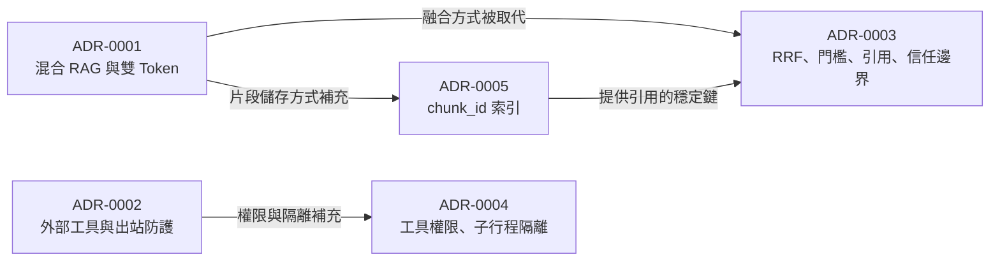

# AskMiao 架構決策紀錄 (Architecture Decision Records)

[繁體中文](README.md) | [English](README_en.md)

本目錄記錄 AskMiao 開發過程中的重要架構決策：當時面對的問題、選擇的方案，以及接受的取捨。程式碼說明系統「怎麼做」，ADR 說明「為什麼這樣做」，避免日後有人把刻意的設計當成缺陷改掉。

---

## 決策紀錄索引

| ADR | 標題 | 狀態 | 決策日期 | 相關版本 | 摘要 |
|---|---|---|---|---|---|
| [ADR-0001](./0001-hybrid-rag-and-security.md) | 增強型混合 RAG 檢索架構與雙 Token 安全防護決策 | 已通過 (Accepted) | 2026-08-01 | 1.0.0 | 採用 FAISS + Whoosh + Cross-Encoder 混合 RAG 與 RSA-2048 JWT 雙 Token 防護；其中的分數歸一化融合已由 ADR-0003 取代 |
| [ADR-0002](./0002-external-tools-and-outbound-safety.md) | 外部工具擴充機制與出站請求安全防護決策 | 已通過 (Accepted) | 2026-09-01 | 2.1.0–2.2.1 | 以資料庫驅動之自訂 API / MCP 工具註冊，並集中實施 SSRF 防護與錯誤代碼機制 |
| [ADR-0003](./0003-rrf-relevance-citations-and-tool-trust.md) | RRF 融合、相關性門檻、引用對應與工具輸出信任邊界 | 已通過 (Accepted) | 2026-09-24 | 3.0.0 | 兩軌必跑的標準 RRF、以重排機率為相關性門檻、答案引用對應來源，並為工具輸出設立信任邊界與聯網限制；取代 ADR-0001 的分數歸一化融合 |
| [ADR-0004](./0004-tool-admin-permissions-and-subprocess-isolation.md) | 工具管理權限、MCP 子行程隔離與逐跳 SSRF 驗證 | 已通過 (Accepted) | 2026-09-25 | 3.0.0 | MCP 伺服器與自訂 API 工具只開放管理員管理，stdio 子行程不繼承後端機密環境變數，出站請求的每次轉址都重新做 SSRF 驗證；補充 ADR-0002 |
| [ADR-0005](./0005-chunk-id-index-and-database-source-of-truth.md) | 以資料庫 chunk_id 為準的片段索引 | 已通過 (Accepted) | 2026-09-24 | 3.0.0 | 片段改存資料庫 `rag_chunks`，FAISS（`IndexIDMap2`）與 BM25 以 chunk_id 對應，啟動時依資料庫校正，取代依清單位置對齊與每日自動重建；補充 ADR-0001 |

---

## 何時寫 ADR

同時符合以下三點時才需要新增 ADR：

1. **難以回頭**：日後改變心意的成本很高，例如資料格式、索引結構、權限模型。
2. **沒有背景會令人意外**：不知道當時的考量，讀者會以為這是缺陷。
3. **確實有取捨**：存在其他可行方案，並為了特定理由選擇其中之一。

可以輕易改回來、或只是理所當然的做法，寫在程式註解或 CHANGELOG 即可。

## 撰寫規範

- **檔名**：`NNNN-英文短名.md`，編號依序遞增；每份 ADR 都有 `_en.md` 英文版，兩份內容一致。
- **標題**：`ADR-NNNN: 決策標題`，標題下方附語言切換連結。
- **狀態**：`提議 (Proposed)`、`已通過 (Accepted)`、`已廢棄 (Deprecated)` 或 `已被取代 (Superseded)`，並註明日期；補充或取代其他 ADR 時在狀態下方說明關係。
- **章節**：
  1. **背景與問題陳述**：為什麼需要做決定，當時遇到哪些具體問題。
  2. **架構決策內容**：選擇的方案，必要時列出考慮過但放棄的做法與理由。
  3. **決定產生的影響與權衡**：正面影響、負面影響與風險；會影響既有部署時，另附「升級與回退」。
- **後續修訂**：決策被部分推翻或延伸時，在原 ADR 末尾新增「後續修訂 (Amendments)」條目（日期、摘要與新 ADR 連結），不改寫原本的決策內容。
- **補記**：事後才整理的 ADR，在狀態區註明補記日期與依據的實作版本。
