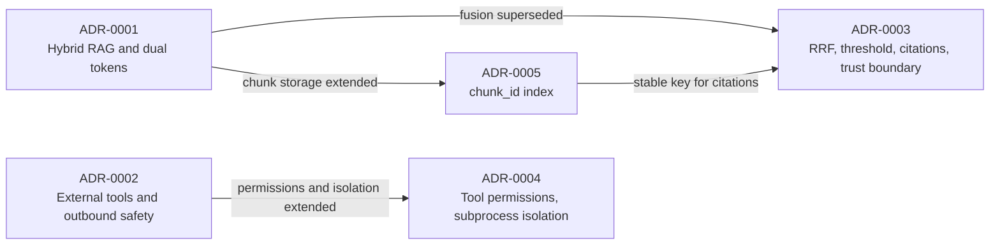

# AskMiao Architecture Decision Records (ADR)

[繁體中文](README.md) | [English](README_en.md)

This directory records the major architectural decisions made while building AskMiao: the problems at the time, the chosen solutions, and the trade-offs accepted. Code shows *how* the system works; ADRs explain *why*, so a deliberate design is not "fixed" later as if it were a bug.

---

## ADR Index

| ADR | Title | Status | Date | Versions | Summary |
|---|---|---|---|---|---|
| [ADR-0001](./0001-hybrid-rag-and-security_en.md) | Contextual Hybrid RAG & Dual-Token Security Architecture | Accepted | 2026-08-01 | 1.0.0 | Adopts FAISS + Whoosh + Cross-Encoder RAG and RSA-2048 JWT dual-token defense; its score normalization fusion was superseded by ADR-0003 |
| [ADR-0002](./0002-external-tools-and-outbound-safety_en.md) | External Tool Extensibility & Outbound Request Safety | Accepted | 2026-09-01 | 2.1.0–2.2.1 | Database-driven custom API / MCP tool registration with a centralized SSRF guard and error code mechanism |
| [ADR-0003](./0003-rrf-relevance-citations-and-tool-trust_en.md) | RRF Fusion, Relevance Threshold, Citations & Tool-Output Trust Boundary | Accepted | 2026-09-24 | 3.0.0 | Standard RRF with both tracks always running, a relevance threshold on the reranker probability, answer citations mapped to sources, and a trust boundary plus web restrictions for tool output; supersedes ADR-0001's score normalization fusion |
| [ADR-0004](./0004-tool-admin-permissions-and-subprocess-isolation_en.md) | Tool Management Permissions, MCP Subprocess Isolation & Per-Hop SSRF Validation | Accepted | 2026-09-25 | 3.0.0 | MCP servers and custom API tools are managed by admins only, stdio subprocesses no longer inherit backend secrets, and every redirect of an outbound request is SSRF-validated again; extends ADR-0002 |
| [ADR-0005](./0005-chunk-id-index-and-database-source-of-truth_en.md) | Chunk Index Keyed by Database chunk_id | Accepted | 2026-09-24 | 3.0.0 | Chunks live in the `rag_chunks` table, FAISS (`IndexIDMap2`) and BM25 are keyed by chunk_id and reconciled against the database at startup, replacing list-position alignment and daily rebuilds; extends ADR-0001 |

---

## When to write an ADR

Add an ADR only when all three hold:

1. **Hard to reverse**: changing your mind later is expensive, as with data formats, index structures, or permission models.
2. **Surprising without context**: without the reasoning, a reader would take the design for a defect.
3. **A real trade-off**: other viable options existed and one was chosen for specific reasons.

Decisions that are easy to undo, or simply the obvious approach, belong in code comments or the changelog.

## Guidelines

- **File name**: `NNNN-short-english-slug.md`, numbered sequentially; every ADR has an `_en.md` English version with the same content.
- **Title**: `ADR-NNNN: Decision title`, followed by the language switch links.
- **Status**: `Proposed`, `Accepted`, `Deprecated`, or `Superseded`, with a date; when an ADR extends or supersedes another, say so below the status.
- **Sections**:
  1. **Context**: why a decision was needed and which concrete problems existed.
  2. **Decision**: the chosen solution and, where useful, the rejected options and why.
  3. **Consequences**: benefits, trade-offs, and risks; add "Upgrade & Rollback" when existing deployments are affected.
- **Amendments**: when a decision is partly reversed or extended, append an "Amendments" entry (date, summary, link to the new ADR) to the original ADR instead of rewriting its decision.
- **Retrospective records**: an ADR written after the fact states, in its status section, when it was written and which implementation it describes.
