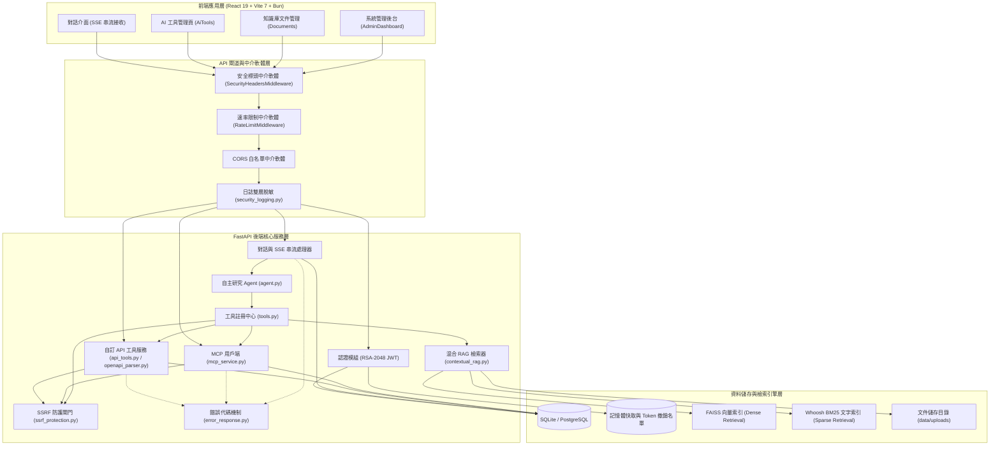
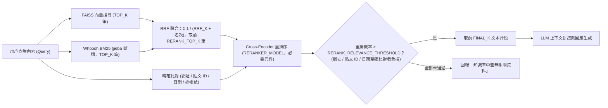
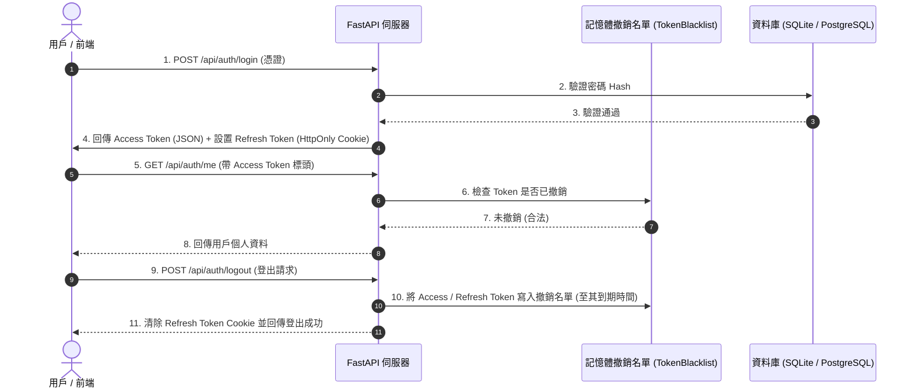
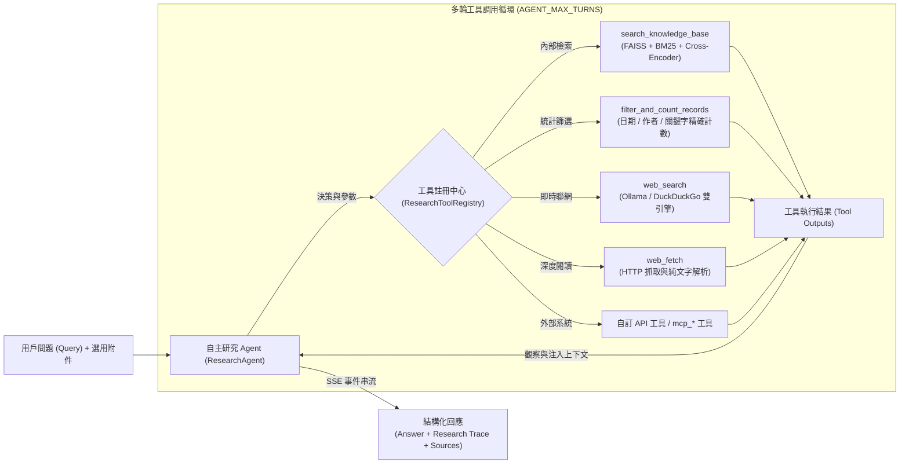
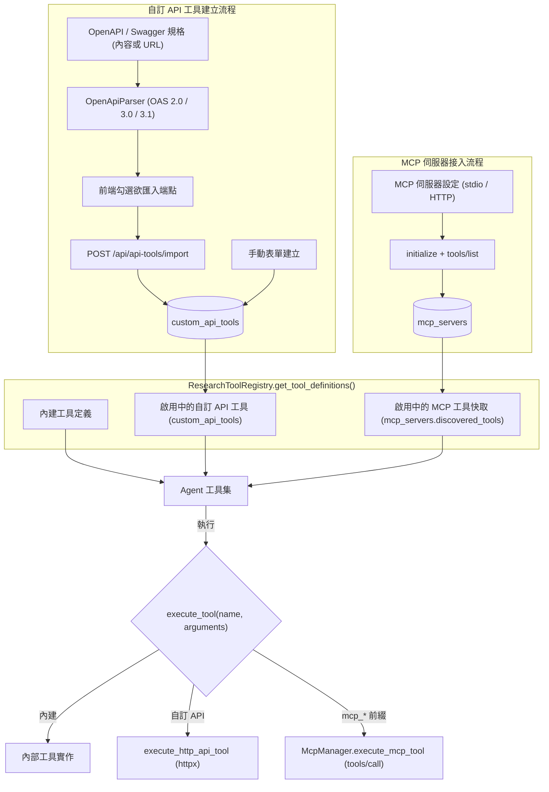
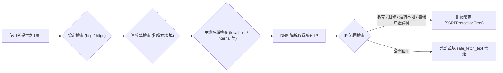

# AskMiao 系統架構與設計文件

[繁體中文](architecture.md) | [English](architecture_en.md)

> 本文件說明 AskMiao 系統整體架構、核心模組關係、增強型混合 RAG 檢索流程、Agentic 自主研究管線、外部工具與 MCP 擴充機制，以及 RSA-2048 雙 Token 認證與安全防護設計。

---

## 1. 系統整體分層架構圖

AskMiao 採前後端分離與模組化架構。前端由 React 19 與 Vite 7（Bun 建構）驅動，後端由 FastAPI 提供非同步 RESTful API、SSE 串流與 WebSocket 服務。資料持久層透過 SQLAlchemy 連接關聯式資料庫（`DATABASE_URL` 可指向 SQLite 或 PostgreSQL），快取與 Token 撤銷名單則採用行程內記憶體實作，無外部 Redis 依賴。

---

## 2. 增強型混合 RAG 檢索與重排序管道

系統每次查詢都同時執行稠密向量搜尋（Dense Retrieval）與稀疏關鍵字搜尋（Sparse Retrieval），以 RRF 依名次融合後送入 Cross-Encoder 重排序，再以重排模型的相關機率過濾無關片段。

### 檢索管道核心處理解析

1. **文字切塊 (Chunking)**：上傳文件經 `RecursiveCharacterTextSplitter` 處理，切塊大小與重疊由 `CHUNK_SIZE` / `CHUNK_OVERLAP` 控制（範本預設 300 / 100 字元）。結構化記錄與 JSON 資料另以「原子記錄分塊」方式建立，確保逐筆統計正確。
2. **向量嵌入 (Embedding)**：預設採用 `BAAI/bge-small-zh-v1.5`（`EMBEDDING_MODEL`），向量維度於載入模型時自動取得。片段存於資料庫 `rag_chunks` 表，FAISS 以 `IndexIDMap2(IndexFlatIP)` 內積索引、BM25 以 `doc_id` 皆用 chunk_id 對應；刪除文件只移除該文件的向量，不需重新嵌入，啟動時並依資料庫校正兩份索引。
3. **關鍵字檢索 (BM25)**：結合 `Whoosh` 搜尋引擎與 `jieba` 中文分詞，補足向量檢索對專有名詞與代碼之弱點。斷詞結果一律轉小寫（查 `mes` 可對到 `MES`）；主詞典可用 `JIEBA_DICTIONARY` 替換（例如繁體較友善的 `dict.txt.big`），領域詞來自 `DOMAIN_PROFILE_PATH` 指定的領域設定檔。BM25 索引目錄記錄斷詞簽章（規則版本、主詞典雜湊、領域詞雜湊），簽章不符時啟動會自動重建 BM25，向量不需重算；唯讀評估遇到簽章不符則拒絕執行。
4. **融合 (Fusion)**：兩軌每次必跑、各取 `TOP_K` 筆，以標準 RRF 依名次合併：分數 = Σ 1 / (`RRF_K` + 名次)，不加權，取前 `RERANK_TOP_K` 筆送去重排。只有單一軌道找到的片段也能進入候選。網址、貼文 ID、日期、@帳號的精確比對結果另外加入候選並排在最前面。
5. **重排序與相關性門檻 (Reranking)**：Cross-Encoder（預設 `BAAI/bge-reranker-base`）為必要元件，載入失敗時後端無法啟動；執行時重排失敗則回傳錯誤代碼，不會退回未過濾的片段。相關性門檻 `RERANK_RELEVANCE_THRESHOLD` 直接套在重排模型的機率上，精確比對到網址、貼文 ID、日期的片段不受限制；混合分數（`RERANK_WEIGHT` × 重排機率 + (1 − `RERANK_WEIGHT`) × 候選原分數）只用於排序。通過門檻者取前 `FINAL_K` 段，全部未通過時 `search_knowledge_base` 明確回報「知識庫中查無相關資料」；指定 `target_document` 時在重排前就限定該文件，查不到也不會改用全庫結果。
6. **檢索評估 (Evaluation)**：`evaluator.py` 以線上實際的檢索流程（重排後套用設定門檻，與 `smart_search` 相同）計算文件層級的 hit@k、recall@k 與 MRR；問答集可寫 `"relevant_sources": []` 表示應查無資料的反例，另計反例拒絕率。`scripts/evaluate_retrieval.py` 讀取 JSONL 標準問答集（格式見 `backend/eval/retrieval_golden.example.jsonl`），在索引副本上唯讀執行，可用 `--min-mrr` 作為 CI 門檻，並可用 `--relevance-thresholds` 對同一次重排結果比較多個門檻，校準 `RERANK_RELEVANCE_THRESHOLD`。

---

## 3. RSA-2048 雙 Token 認證與撤銷名單生命週期

系統採 Access Token 與 Refresh Token 雙令牌機制。Access Token 預設 30 分鐘（`ACCESS_TOKEN_EXPIRE_MINUTES`），Refresh Token 存放於 HttpOnly Cookie（預設 7 天，`REFRESH_TOKEN_EXPIRE_DAYS`），登出時兩者皆寫入行程內撤銷名單（`TokenBlacklist`）。

> 撤銷名單為行程內記憶體結構，具備自動清理過期項目之機制；後端重啟後名單將重置，未過期之舊 Token 於重啟後會重新被視為有效。

---

## 4. Agentic RAG 自主研究與多輪工具調用管線

系統採 ReAct 自主研究代理人架構（`ResearchAgent`），透過 Native Tool Calling 實現多輪工具協同與上下文自主搜集，最大輪數由 `AGENT_MAX_TURNS` 控制。

### 自主研究核心機制

1. **動態決策思考**：模型依問題語境自主判斷應查詢內部知識庫、進行統計篩選、外部即時聯網、深入閱讀 URL，或調用外部 API / MCP 工具。模型不再呼叫工具時，該次產生的內容即為最終答案並直接送出；只有工具輪數用完或模型回傳空內容時，才以串流再生成一次答案。
2. **研究歷程追蹤 (Research Trace)**：每輪工具調用之步驟、工具名稱、輸入參數、輸出摘要與耗時皆結構化記錄，透過 `step_start` / `step_end` SSE 事件即時推送前端折疊時間軸。
3. **引用與來源標籤 (Citations)**：每次提問建立一張引用編號表（`research_session.py`），知識庫片段以 chunk_id、網頁以網址為鍵，第一次出現時配號並寫入工具結果；模型以 `[n]` 標註出處。答案完成後解析 `[n]`（支援 `[1,2]`、`[1][2]`），`sources_detail` 只列實際被引用的條目，依第一次引用的順序排列並去重；沒有任何引用時不顯示來源標籤。先前回答中的 `[n]` 在帶入前文時會移除，避免沿用舊編號。
4. **多模態輸入**：附件中的圖片以 `image_url` 內容區塊送入視覺模型，文字類附件則抽取內容併入提問上下文。
5. **對話前文**：每次提問從資料庫 `messages` 表讀取最近 `CONVERSATION_HISTORY_MESSAGES` 則訊息作為前文，後端重啟不影響。
6. **多供應商工具呼叫**：`llm_client.py` 統一 OpenAI、Azure OpenAI、Claude（官方 `anthropic` SDK）、Gemini 與 Ollama 的呼叫格式，皆支援工具呼叫與串流。

---

## 5. 外部工具擴充與 MCP 整合架構

除內建工具外，系統提供兩條工具擴充路徑，皆在組裝工具定義時由資料庫動態載入，變更後無需重啟後端。

### 設計要點

1. **工具命名與路由**：自訂 API 工具以其 `name` 直接註冊；MCP 工具統一採 `mcp_<伺服器名稱>_<工具名稱>` 命名，`execute_tool` 依前綴判斷路由目標。
2. **HTTP 執行器**：`execute_http_api_tool` 統一處理 Path 變數替換、Query 組裝、Header 與認證注入（Bearer / API Key / Basic）、JSON 或表單主體序列化，以及逾時與錯誤隔離。
3. **MCP 傳輸**：`McpStdioClient` 以子行程 stdio 進行 JSON-RPC 交握；`McpHttpClient` 以 HTTP 傳輸，兩者皆支援 `initialize`、`tools/list` 與 `tools/call`。
4. **工具快取**：MCP 工具清單於建立或手動探索時寫入 `discovered_tools`，避免每次組裝工具定義都需重新連線。

---

## 6. 安全性設計

### 6.1 敏感資料雙層脫敏

為通過安全稽核（修復 CodeQL `py/clear-text-logging-sensitive-data` 告警），`backend/app/core/security_logging.py` 實施兩道遮罩防線：

1. **物件層級遞迴脫敏 (`sanitize_sensitive_data`)**：遍歷字典與列表，匹配敏感 Key（`password`、`token`、`secret`、`authorization`、`cookie` 等，不分大小寫），將值替換為 `[REDACTED]`。
2. **字串層級二次正則遮罩**：於 JSON 序列化或日誌輸出前再次掃描，確保任何格式之敏感金鑰皆不遺留於日誌。

### 6.2 錯誤代碼機制（CWE-209 / CWE-497）

`error_response.py` 將未預期例外之完整訊息與堆疊僅寫入伺服器日誌，對外回傳隨機錯誤代碼：

- `log_and_get_error_id()`：記錄例外並產生 12 碼識別碼。
- `format_client_error()` / `build_error_payload()`：組出不含內部細節之對外訊息與 `error_id`。
- `SafeClientError`：標記「訊息僅描述使用者輸入本身」之驗證錯誤，可原樣回傳協助使用者修正。

此機制亦套用於 SSE 串流之 `error` 事件，避免例外文字經串流外洩。

### 6.3 SSRF 防護

所有由使用者輸入驅動之外部請求（OpenAPI 規格 URL、`web_fetch`、MCP HTTP 傳輸、自訂 API 工具）皆須通過 `ssrf_protection.py`：

阻擋範圍涵蓋 IPv4 / IPv6 私有與保留網段、迴環與連結本地位址、雲端中繼資料端點（如 `169.254.169.254`）、內部網域後綴，以及危險連接埠清單。相關行為由 `backend/tests/test_ssrf_protection.py` 覆蓋。

### 6.4 工具輸出信任邊界與聯網限制

工具結果（知識庫片段、網頁內容、外部 API 回應）可能夾帶提示注入，因此 Agent 一律把工具結果包在每次提問不同 id 的 `<untrusted_tool_result>` 標記內，系統提示要求只把它當資料、不照其中的指令做，也不把對話或知識庫內容拼進網址或搜尋字串。程式層另有三道限制：

1. **網址來源限制**：`web_fetch` 只能讀取使用者訊息（含附件文字與先前的使用者訊息）或本次內建工具結果的資料欄位中原樣出現過的網址。工具結果中回聲的查詢參數不算，因此模型無法先把資料塞進查詢、再以「出現過」的網址外送。
2. **網域白名單**：`WEB_FETCH_ALLOWED_DOMAINS` 限定可讀取的網域（含子網域），明確寫 `*` 才表示不限制。
3. **讀過知識庫後停用聯網**：`BLOCK_WEB_TOOLS_AFTER_KB` 開啟時，同一次提問只要知識庫工具回傳過內容，之後的 `web_search` 與 `web_fetch` 一律拒絕。

自訂 API 與 MCP 工具的結果同樣包上不可信標記，但不列入網址來源與引用編號，其出站請求不在上述限制範圍內（已知風險，見 ADR-0003）。

### 6.5 其他防護

- **安全標頭**：`SecurityHeadersMiddleware` 統一注入安全回應標頭。
- **速率限制**：`RateLimitMiddleware` 依 `RATE_LIMIT_PER_MINUTE` 限制單位時間請求數。
- **CORS 白名單**：僅允許 `ALLOWED_ORIGINS`（可附加 `DEVTUNNEL_URL`）之來源，並允許憑證攜帶。
- **輸入驗證**：`input_validator.py` 檢查檔名、副檔名與路徑遍歷攻擊樣態。

---

## 7. 架構決策紀錄 (ADR)

專案重大架構決策均獨立記載於 ADR 文件中：

- [ADR 索引與說明](./adr/README.md)
- [ADR-0001: 增強型混合 RAG 檢索架構與雙 Token 安全防護決策](./adr/0001-hybrid-rag-and-security.md)
- [ADR-0002: 外部工具擴充機制與出站請求安全防護決策](./adr/0002-external-tools-and-outbound-safety.md)
- [ADR-0003: RRF 融合、相關性門檻、引用對應與工具輸出信任邊界](./adr/0003-rrf-relevance-citations-and-tool-trust.md)
