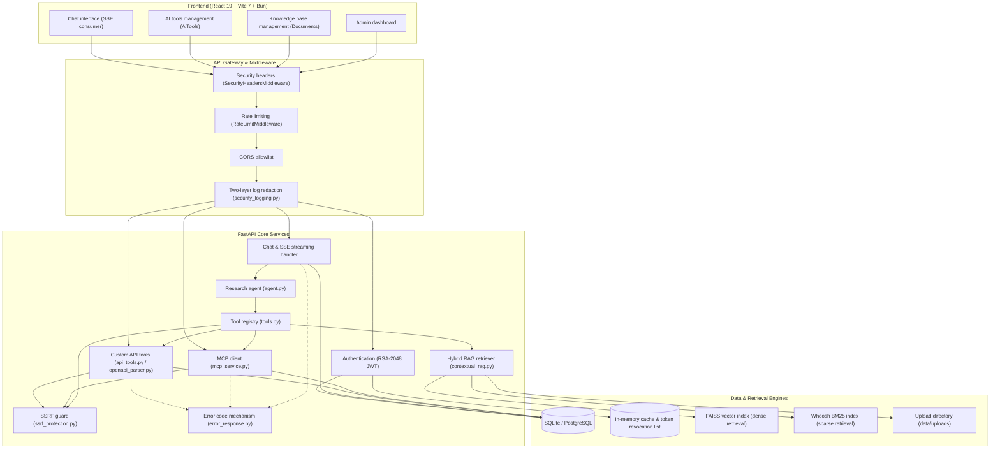
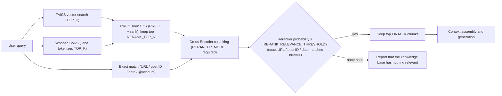
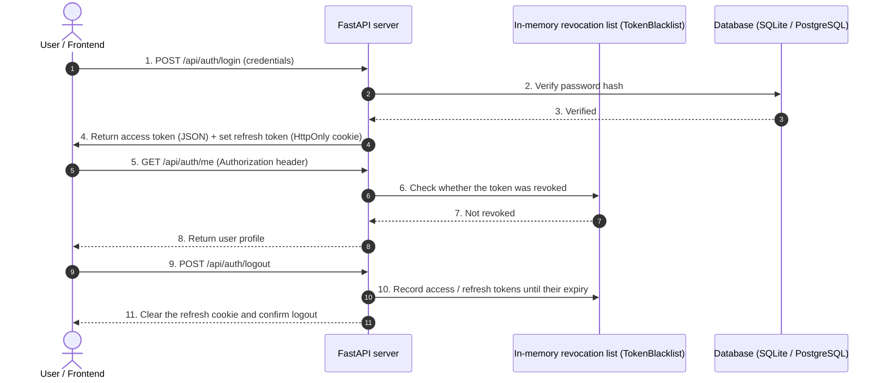
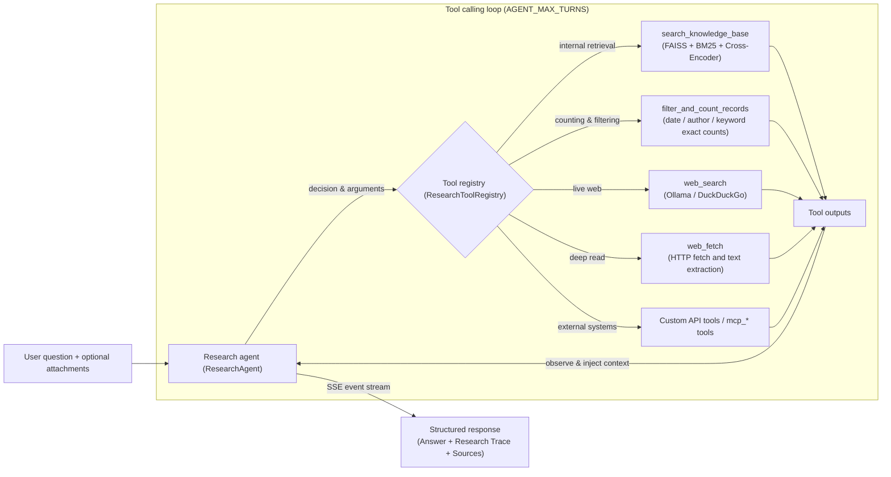
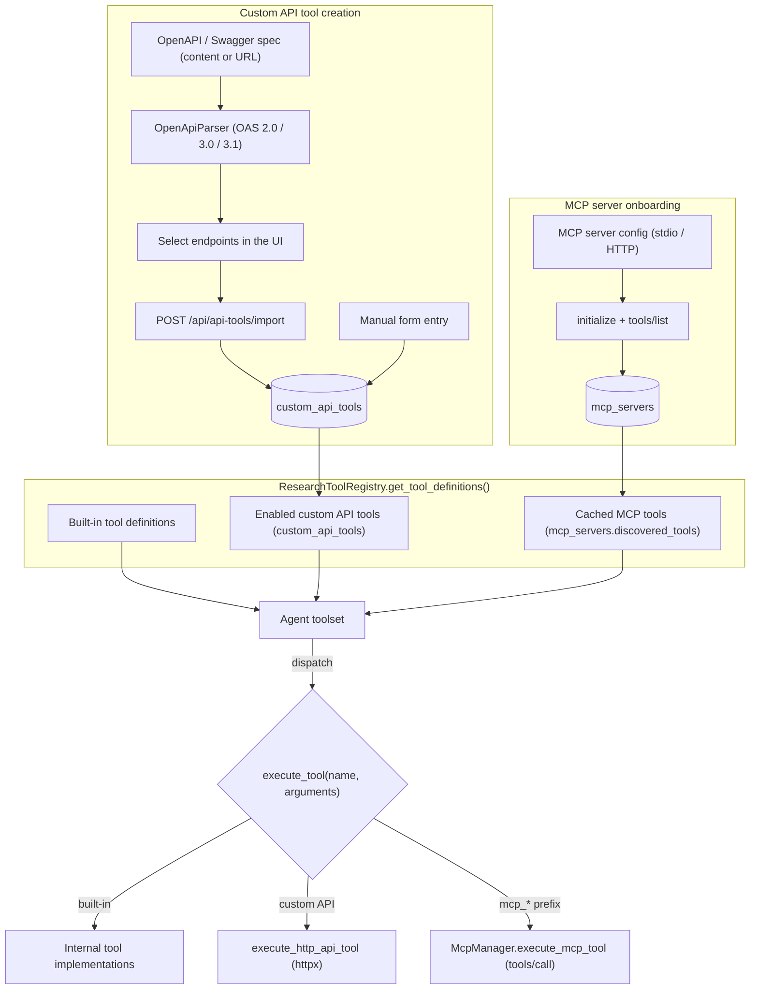
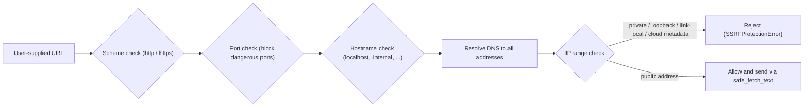

# AskMiao Architecture & Design

[繁體中文](architecture.md) | [English](architecture_en.md)

> This document covers the overall AskMiao architecture, module relationships, the enhanced hybrid RAG retrieval flow, the agentic research pipeline, external tool and MCP extensibility, and the RSA-2048 dual-token security design.

---

## 1. Layered System Architecture

AskMiao separates frontend and backend. The frontend runs on React 19 and Vite 7 (built with Bun); the backend exposes asynchronous RESTful APIs, SSE streaming, and WebSocket endpoints through FastAPI. Persistence goes through SQLAlchemy against the database named by `DATABASE_URL` (SQLite or PostgreSQL). Caching and token revocation are in-process memory structures, with no external Redis dependency.

---

## 2. Enhanced Hybrid RAG Retrieval & Reranking

Every query runs both dense vector search and sparse keyword search; the two rankings are merged by rank with RRF, reranked by a Cross-Encoder, and filtered by the reranker's relevance probability.

### Pipeline details

1. **Chunking**: uploaded documents run through `RecursiveCharacterTextSplitter`, sized by `CHUNK_SIZE` / `CHUNK_OVERLAP` (300 / 100 characters in the shipped template). Structured and JSON records are additionally stored as atomic record chunks so per-record counting stays exact.
2. **Embedding**: `BAAI/bge-small-zh-v1.5` by default (`EMBEDDING_MODEL`); the vector dimension is read from the loaded model. Chunks live in the `rag_chunks` database table; FAISS (`IndexIDMap2(IndexFlatIP)`) and BM25 (`doc_id`) are both keyed by chunk_id, so deleting a document removes only its vectors without re-embedding, and both indexes are reconciled against the database at startup.
3. **Keyword retrieval (BM25)**: `Whoosh` plus `jieba` tokenization compensates for the weakness of vector search on proper nouns and identifiers. Tokens are always lowercased (a query for `mes` matches `MES`); the main dictionary can be replaced with `JIEBA_DICTIONARY` (for example the Traditional-Chinese-friendly `dict.txt.big`), and domain words come from the profile at `DOMAIN_PROFILE_PATH`. The BM25 index directory stores a tokenizer signature (rules version, main-dictionary hash, domain-words hash); on a mismatch the backend rebuilds BM25 at startup without recomputing vectors, and read-only evaluation refuses to run.
4. **Fusion**: both tracks always run, each returning `TOP_K` results, and are merged with standard, unweighted RRF: score = Σ 1 / (`RRF_K` + rank); the top `RERANK_TOP_K` go to the reranker. A chunk found by only one track still becomes a candidate. Exact matches on URLs, post IDs, dates, and @accounts are added as candidates and ranked first.
5. **Reranking and relevance threshold**: the Cross-Encoder (`BAAI/bge-reranker-base` by default) is a required component: the backend refuses to start if it cannot load, and a reranking failure at query time returns an error code instead of unfiltered chunks. `RERANK_RELEVANCE_THRESHOLD` applies directly to the reranker's probability, except for exact URL, post ID, and date matches; the mixed score (`RERANK_WEIGHT` × probability + (1 − `RERANK_WEIGHT`) × candidate score) is used only for ordering. The top `FINAL_K` passing chunks form the context; when none pass, `search_knowledge_base` explicitly reports that the knowledge base has nothing relevant. A `target_document` restricts candidates before reranking and never falls back to the whole library.
6. **Evaluation**: `evaluator.py` computes document-level hit@k, recall@k, and MRR through the production path (rerank, then the configured threshold, exactly as `smart_search`); golden-set entries with `"relevant_sources": []` are negatives that should find nothing and feed a negative rejection rate. `scripts/evaluate_retrieval.py` reads a JSONL golden set (format in `backend/eval/retrieval_golden.example.jsonl`), runs read-only on a copy of the indexes, can gate CI with `--min-mrr`, and with `--relevance-thresholds` compares several thresholds over a single rerank pass to calibrate `RERANK_RELEVANCE_THRESHOLD`.

---

## 3. RSA-2048 Dual-Token Authentication & Revocation Lifecycle

Access tokens last 30 minutes by default (`ACCESS_TOKEN_EXPIRE_MINUTES`); refresh tokens live in an HttpOnly cookie for 7 days (`REFRESH_TOKEN_EXPIRE_DAYS`). Logging out adds both to the in-process revocation list (`TokenBlacklist`).

> The revocation list is an in-process structure that prunes expired entries automatically. It resets when the backend restarts, so tokens that have not yet expired become valid again after a restart.

---

## 4. Agentic RAG Research & Multi-Turn Tool Calling

The ReAct research agent (`ResearchAgent`) uses native tool calling to gather context over multiple turns, bounded by `AGENT_MAX_TURNS`.

### Core mechanics

1. **Autonomous decisions**: the model decides per question whether to query the knowledge base, run exact counting, search the web, deep-read a URL, or call an external API / MCP tool. When the model stops calling tools, the content of that response is the final answer and is sent as is; the answer is streamed from a fresh call only when the turn limit is reached or the model returns empty content.
2. **Research trace**: every turn records the step, tool name, arguments, output summary, and duration, streamed live to the collapsible frontend timeline via `step_start` / `step_end` SSE events.
3. **Citations and source badges**: each question builds a citation table (`research_session.py`) keyed by chunk_id for knowledge-base chunks and by URL for web pages; numbers are assigned on first appearance and written into the tool results, and the model cites them as `[n]`. After the answer completes, `[n]` markers (including `[1,2]` and `[1][2]`) are parsed and `sources_detail` lists only the cited entries, deduplicated in order of first citation; an answer without citations shows no source badges. `[n]` markers in earlier answers are stripped from the history so stale numbers are not reused.
4. **Multimodal input**: image attachments are passed as `image_url` content parts to vision models; text attachments are extracted into the prompt context.
5. **Conversation history**: each question loads the latest `CONVERSATION_HISTORY_MESSAGES` messages from the `messages` table, so restarts do not lose context.
6. **Multi-provider tool calling**: `llm_client.py` unifies OpenAI, Azure OpenAI, Claude (official `anthropic` SDK), Gemini, and Ollama, all with tool calling and streaming.

---

## 5. External Tool Extensibility & MCP Integration

Beyond the built-in toolset, two extension paths feed the agent. Both are loaded from the database whenever tool definitions are assembled, so changes take effect without a backend restart.

### Design notes

1. **Naming and routing**: custom API tools register under their own `name`; MCP tools use `mcp_<server_name>_<tool_name>`, and `execute_tool` routes on that prefix.
2. **HTTP executor**: `execute_http_api_tool` handles path variable substitution, query assembly, header and auth injection (Bearer / API Key / Basic), JSON or form body serialization, plus timeout and error isolation.
3. **MCP transports**: `McpStdioClient` speaks JSON-RPC over a subprocess's stdio, `McpHttpClient` over HTTP; both support `initialize`, `tools/list`, and `tools/call`. A stdio subprocess inherits only essential system variables such as `PATH` (the same default list as the official MCP SDK), so the backend's JWT key, database URL, and model API keys never reach it; list any variable the server needs in its `env_vars`.
4. **Tool caching**: discovered MCP tools are stored in `discovered_tools` at creation or manual discovery time, so assembling tool definitions does not require reconnecting.
5. **Management permissions**: custom API tools and MCP servers are shared by every user's agent, and `stdio` servers run the configured command on the host, so every endpoint under `/api/api-tools` and `/api/mcp`, including the read-only ones, is admin-only, and the frontend AI tools page is shown to admins only. Regular users can only use enabled tools through the agent in a conversation.

---

## 6. Security Design

### 6.1 Two-layer sensitive data redaction

To satisfy security review (fixing the CodeQL `py/clear-text-logging-sensitive-data` alert), `backend/app/core/security_logging.py` applies two masking passes:

1. **Recursive object masking (`sanitize_sensitive_data`)**: walks dictionaries and lists, matches sensitive keys (`password`, `token`, `secret`, `authorization`, `cookie`, case-insensitive) and replaces the values with `[REDACTED]`.
2. **String-level regex masking**: a second scan before JSON serialization or log output, so no secret survives in any shape.

### 6.2 Error code mechanism (CWE-209 / CWE-497)

`error_response.py` keeps full exception messages and stack traces in the server log and returns only a random code to clients:

- `log_and_get_error_id()`: logs the exception and produces a 12-character identifier.
- `format_client_error()` / `build_error_payload()`: build the client-facing message and `error_id` without internal details.
- `SafeClientError`: marks validation errors whose message only describes the user's own input, so it can be returned verbatim to help them fix it.

The same mechanism backs the SSE `error` event, so exception text cannot leak through the stream.

### 6.3 SSRF protection

Every outbound request driven by user input (OpenAPI spec URLs, `web_fetch`, MCP HTTP transport, custom API tools) passes through `ssrf_protection.py`. Custom API tools and the MCP HTTP transport validate the first request and every redirect through an httpx request hook (`reject_unsafe_request`), so an external service cannot redirect a request into the internal network:

Blocked targets include IPv4 / IPv6 private and reserved ranges, loopback and link-local addresses, cloud metadata endpoints (such as `169.254.169.254`), internal domain suffixes, and a dangerous port list. The behaviour is covered by `backend/tests/test_ssrf_protection.py`.

### 6.4 Tool-output trust boundary and web restrictions

Tool results (knowledge-base chunks, web pages, external API responses) may carry prompt injection, so the agent wraps every tool result in an `<untrusted_tool_result>` marker whose id changes per question. The system prompt tells the model to treat it as data only, never to follow instructions inside it, and never to put conversation or knowledge-base content into URLs or search strings. Three limits are enforced in code:

1. **URL provenance**: `web_fetch` may only read URLs that appear verbatim in the user's messages (including attachment text and earlier user messages) or in the data fields of this question's built-in tool results. Query arguments echoed back by a tool do not count, so the model cannot smuggle data into a query and then fetch it as a URL that "appeared".
2. **Domain allowlist**: `WEB_FETCH_ALLOWED_DOMAINS` restricts readable domains (subdomains included); only an explicit `*` means unrestricted.
3. **No web after knowledge-base reads**: with `BLOCK_WEB_TOOLS_AFTER_KB` enabled, once a knowledge-base tool returns content in a question, later `web_search` and `web_fetch` calls are refused.

Results from custom API and MCP tools are wrapped as untrusted too, but they neither feed URL provenance nor receive citation numbers, and their outbound requests are outside these limits (a known risk, see ADR-0003).

### 6.5 Other protections

- **Security headers**: `SecurityHeadersMiddleware` injects hardened response headers.
- **Rate limiting**: `RateLimitMiddleware` enforces `RATE_LIMIT_PER_MINUTE`.
- **CORS allowlist**: only `ALLOWED_ORIGINS` (optionally plus `DEVTUNNEL_URL`) may call the API, with credentials allowed.
- **Input validation**: `input_validator.py` checks filenames, extensions, and path traversal patterns.

---

## 7. Architecture Decision Records (ADR)

Significant architectural decisions are recorded separately:

- [ADR index](./adr/README.md)
- [ADR-0001: Enhanced hybrid RAG retrieval and dual-token security](./adr/0001-hybrid-rag-and-security.md)
- [ADR-0002: External tool extensibility and outbound request safety](./adr/0002-external-tools-and-outbound-safety_en.md)
- [ADR-0003: RRF fusion, relevance threshold, citations, and tool-output trust boundary](./adr/0003-rrf-relevance-citations-and-tool-trust_en.md)
